## **Previously on 201**
.pull-left[
  
### Linguistics
  - **science**
  - **mental grammar**

### prescriptivism

### descriptivism

### grammaticality

### standardness

### **subfields of Linguistics**
]

.pull-right[
Major subfields of linguistics:  
- **Phonetics** – physical attributes of speech sounds  
- **Phonology** – speech sounds considered as a system  
- **Morphology** – structure of words  
- **Syntax** – structure of sentences  
- **Semantics** – literal meaning  
- **Pragmatics** – implied meaning
]
---
class: center, middle
# **morpheme**

### <b>smallest linguistic unit</b> <b>with</b> <b>meaning</b>
  
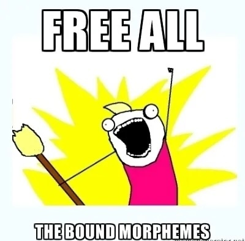

---
## **Dressing and Naming**

<table style="border-collapse: collapse; border: none; width: auto; text-align:center; vertical-align:middle;">
  <colgroup>
    <col style="width: 15em;">
    <col style="width: 15em;">
    <col style="width: 15em;">
  </colgroup>
  <tr>
    <td>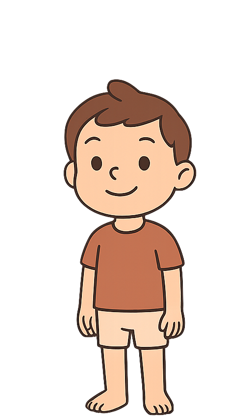</td>
    <td>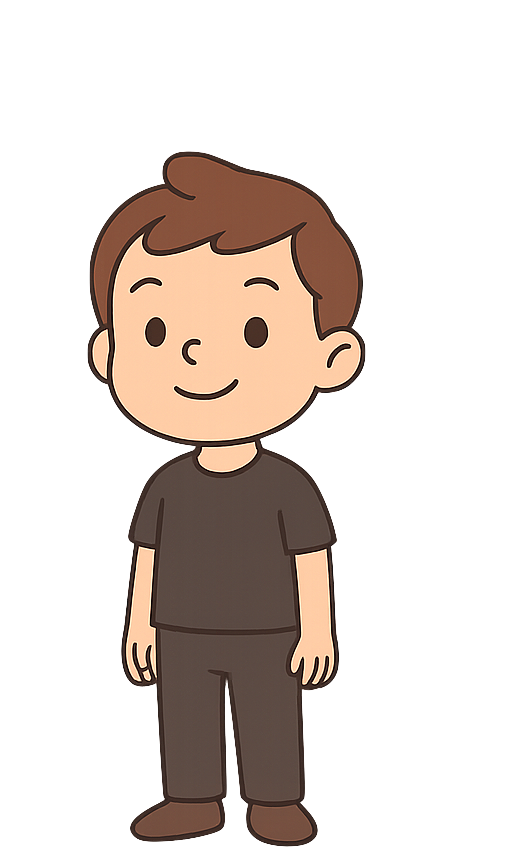</td>
    <td>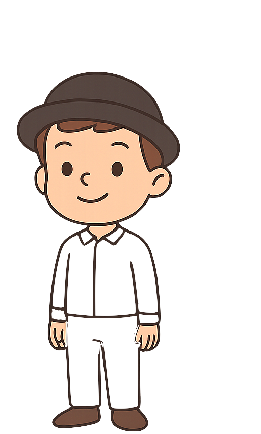</td>
  </tr>
  <tr>
    <td><b>Merlin</b></td>
    <td><b>Merlin-Brown</b></td>
    <td><b>Brown-Merlin-White</b></td>
  </tr>
</table>

---
## **Dressing and Naming**
  
<table style="border-collapse: collapse; border: none; width: auto; text-align:center; vertical-align:middle;">
  <colgroup>
    <col style="width: 15em;">
    <col style="width: 15em;">
    <col style="width: 15em;">
  </colgroup>
  <tr>
    <td>.</td>
    <td>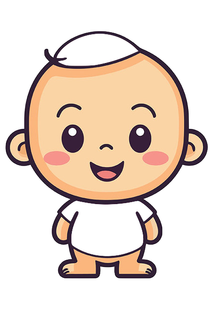</td>
    <td>.</td>
  </tr>
    <tr>
    <td>.</td>
    <td><b>and this is Arthur</b></td>
    <td>.</td>
  </tr>
</table>
---
## **Dressing and Naming**
  
<table style="border-collapse: collapse; border: none; width: auto; text-align:center; vertical-align:middle;">
  <colgroup>
    <col style="width: 15em;">
    <col style="width: 15em;">
    <col style="width: 15em;">
  </colgroup>
  <tr>
    <td>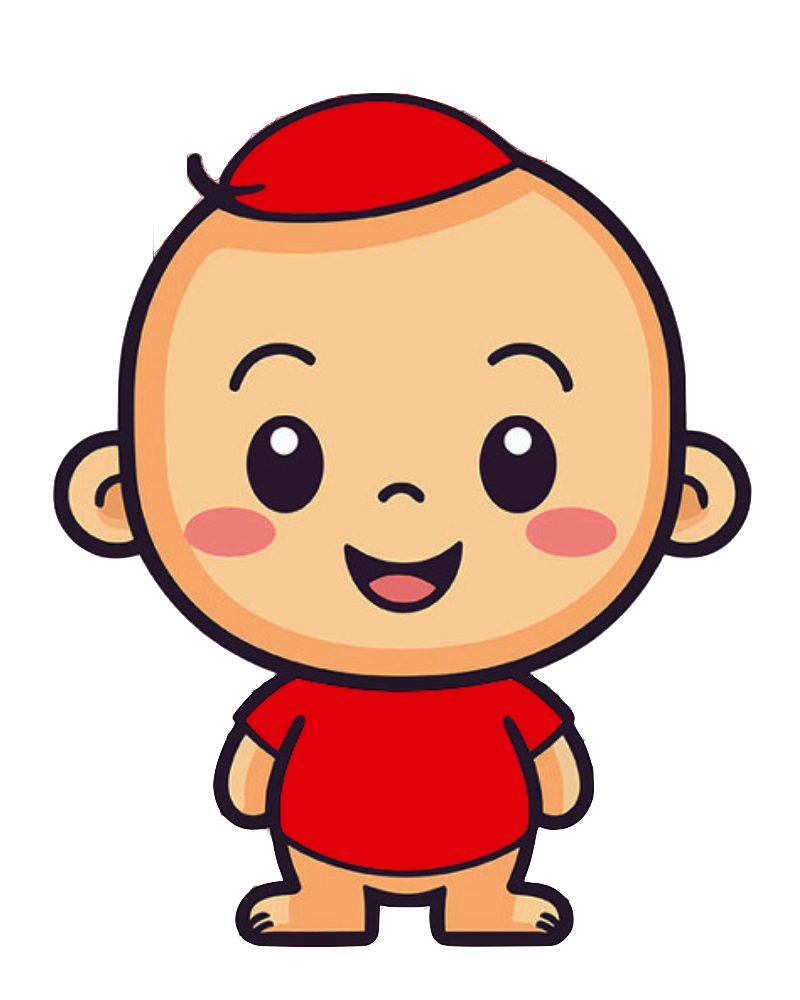</td>
    <td>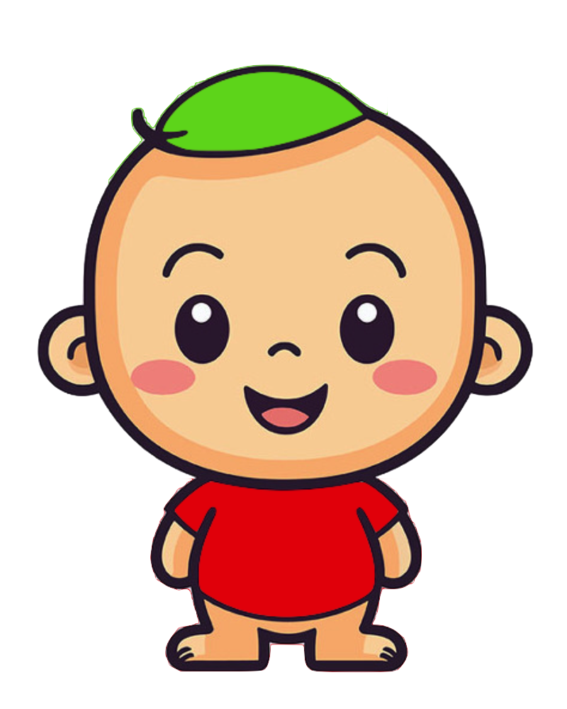</td>
    <td>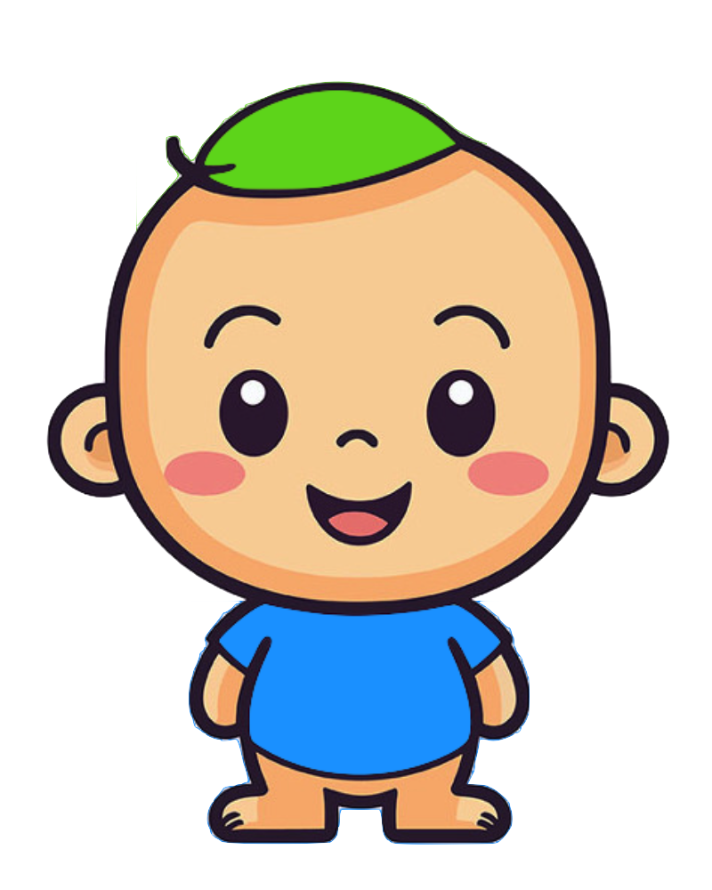</td>
  </tr>
</table>

--
<table style="border-collapse: collapse; border: none; width: auto; text-align:center; vertical-align:middle;">
  <colgroup>
    <col style="width: 15em;">
    <col style="width: 15em;">
    <col style="width: 15em;">
  </colgroup>
  <tr>
    <td><b>Red-Arthur-Red</b></td>
    <td><b>Green-Arthur-Red</b></td>
    <td><b>Green-Arthur-Blue</b></td>
  </tr>
</table>

---
## **Dressing and Naming**
  
<table style="border-collapse: collapse; border: none; width: auto; text-align:center; vertical-align:middle;">
  <colgroup>
    <col style="width: 15em;">
    <col style="width: 15em;">
    <col style="width: 15em;">
  </colgroup>
  <tr>
    <td>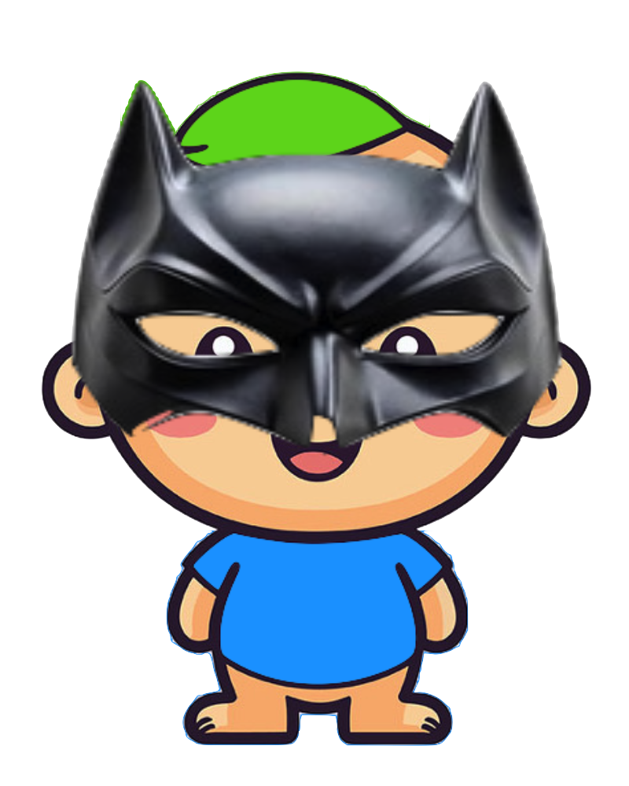</td>
    <td>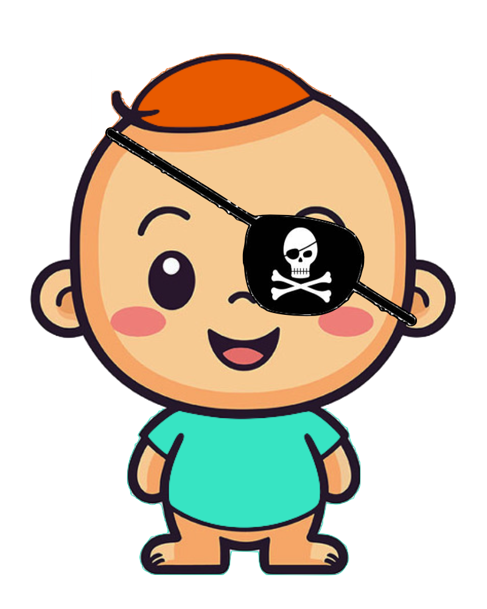</td>
    <td>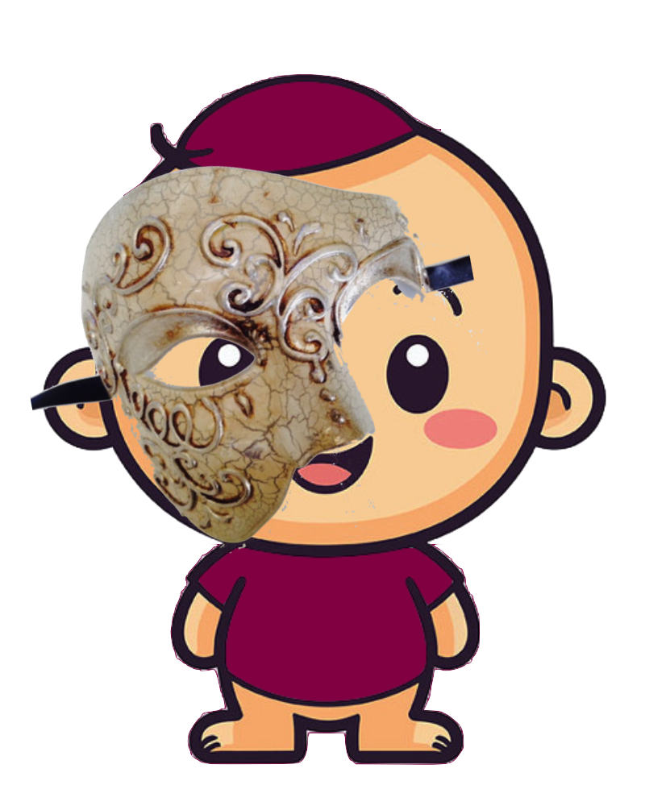</td>
  </tr>
</table>

--
<table style="border-collapse: collapse; border: none; width: auto; text-align:center; vertical-align:middle;">
  <colgroup>
    <col style="width: 16em;">
    <col style="width: 16em;">
    <col style="width: 16em;">
  </colgroup>
  <tr>
    <td><b>Green-BATMAN-Arthur-Blue</b></td>
    <td><b>Orange-PIRATE-Arthur-Teal</b></td>
    <td><b>Claret-PHANTOM-Arthur-Claret</b></td>
  </tr>
</table>

---
## **Dressing and Naming**
  
.pull-left[

]
.pull-right[
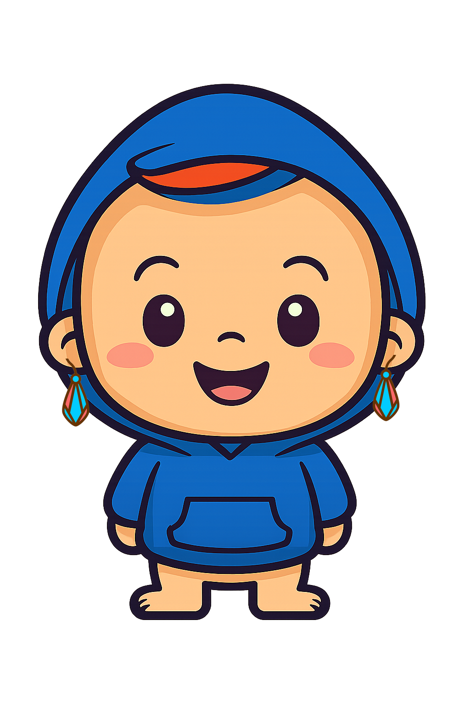
]
--
.pull-left[
<b>BLUE-Arthur-HOODY</b>
]
.pull-right[
<b>BLUE-Ar-EARRING-thur-HOODY</b>
]

---
##**Review of Terms for Different Morphemes**
  
.pull-left[
- <b>root</b> (base; **build**, **flower**)  
- <b>affix</b> (morpheme that attaches to the base)  
  - <b>prefix</b> (**un**-do)  
  - <b>suffix</b> (walk-**ed**)  
  - <b>infix</b> (rare in English)  
  - <b>circumfix</b> (**em**-bold-**en**)  
- <b>free vs. bound morpheme</b>
  - can appear as an independent word?
  - **blue**berry vs. **cran**berry  
]
.pull-right[
- <b>derivational morpheme</b> (piano --> pian-**ist**) 
  - change core meaning even part of speech  
- <b>inflectional morpheme</b> (jump --> jump-**ed**) 
  - add some grammatical nuance  
- <b>homophone</b> (fast-**er**, teach-**er**)
  - same sound, different meanings  
- <b>allomorph</b> (**magic**, **magic**-ian)
  - same meaning, different sounds  
- <b>simple word vs. compound word</b>
  - one root = simple (inter-**nation**-al)
  - more than one = compound (**sawhorse**)
]

---
## Practice: Morphemes
.pull-left[
  
<b>For each word:</b>  
- Indicate whether it is **mono-** or **poly**morphemic
- Indicate whether it is <b>simple</b> or <b>compound</b>
- Divide it into morphemes (use **hyphens**)
  
For each morpheme:
- Indicate whether it is a <b>root</b>, <b>prefix</b>, or, <b>suffix</b>
- Indicate whether it is a **free** or **bound** morpheme
- If it is an affix, indicate whether it is <b>inflectional</b> or <b>derivational</b>
]

.pull-right[
1. unpacks   
2. railroad   
3. chameleon   
4. backpacker   
5. greater   
6. finger   
7. expectant   
8. unbelievably   
9. uncouth   
10. meaningful
]

---
## Practice: Morphemes
.pull-left[
  
<b>For each word:</b>  
- Indicate whether it is **mono-** or **poly**morphemic
- Indicate whether it is <b>simple</b> or <b>compound</b>
- Divide it into morphemes (use **hyphens**)
  
For each morpheme:
- Indicate whether it is a <b>root</b>, <b>prefix</b>, or, <b>suffix</b>
- Indicate whether it is a **free** or **bound** morpheme
- If it is an affix, indicate whether it is <b>inflectional</b> or <b>derivational</b>
]

.pull-right[
.pull-left[
1. unpacks   
2. railroad   
3. chameleon   
4. backpacker   
5. greater   
6. finger   
7. expectant   
8. unbelievably   
9. uncouth   
10. meaningful
]
.pull-right[
**un-pack-s**   
<b>rail-road</b>   
**chameleon**   
<b>back-pack-er</b>   
**great-er**   
<b>finger</b>   
**expect-ant**   
<b>un-believ-ab-ly</b>   
**un-couth**   
<b>mean-ing-ful</b>
]
]

---
## **Dataset 1: Isthmus Zapotec**
### (Oto-Manguean, Mexico)
 
<table style="border-collapse: collapse; border: none; width: auto;">
  <colgroup>
    <col style="width: 2em;">
    <col style="width: 6em;">
    <col style="width: 10em;">
    <col style="width: 2em;">
    <col style="width: 2em;">
    <col style="width: 6em;">
    <col style="width: 10em;">
    <col style="width: 2em;">
    <col style="width: 2em;">
    <col style="width: 6em;">
    <col style="width: 10em;">
  </colgroup>
  <tr>
    <td>01.</td>
    <td>palu</td>
    <td>'stick'</td>
    <td></td>
    <td>06.</td>
    <td>spalube</td>
    <td>'his stick'</td>
    <td></td>
    <td>11.</td>
    <td>spalulu</td>
    <td>'your stick'</td>
  </tr>

  <tr>
    <td>02.</td>
    <td>kuba</td>
    <td>'dough'</td>
    <td></td>
    <td>07.</td>
    <td>skubabe</td>
    <td>'his dough'</td>
    <td></td>
    <td>12.</td>
    <td>skubalu</td>
    <td>'your dough'</td>
  </tr>

  <tr>
    <td>03.</td>
    <td>geta</td>
    <td>'tortilla'</td>
    <td></td>
    <td>08.</td>
    <td>sketabe</td>
    <td>'his tortilla'</td>
    <td></td>
    <td>13.</td>
    <td>sketalu</td>
    <td>'your tortilla'</td>
  </tr>

  <tr>
    <td>04.</td>
    <td>bere</td>
    <td>'chicken'</td>
    <td></td>
    <td>09.</td>
    <td>sperebe</td>
    <td>'his chicken'</td>
    <td></td>
    <td>14.</td>
    <td>sperelu</td>
    <td>'your chicken'</td>
  </tr>
  
  <tr>
    <td>05.</td>
    <td>dolo</td>
    <td>'rope'</td>
    <td></td>
    <td>10.</td>
    <td>stoʔobe</td>
    <td>'his rope'</td>
    <td></td>
    <td>15.</td>
    <td>stoʔolu</td>
    <td>'your rope'</td>
  </tr>
</table>
  

--
- What morphemes does Isthmus Zapotec use to indicate the following concepts?
  - stick, dough, tortilla, chicken, rope
  - third person singular (s/he)
  - second person plural (plural 'you')
  - possission ('s in English)
  
- The word for 'four' is *tapa*. How would you say 'his four' and 'your four'?

---
## **Dataset 1: Isthmus Zapotec**
### (Oto-Manguean, Mexico)
 
<table style="border-collapse: collapse; border: none; width: auto;">
  <colgroup>
    <col style="width: 2em;">
    <col style="width: 6em;">
    <col style="width: 10em;">
    <col style="width: 2em;">
    <col style="width: 2em;">
    <col style="width: 6em;">
    <col style="width: 10em;">
    <col style="width: 2em;">
    <col style="width: 2em;">
    <col style="width: 6em;">
    <col style="width: 10em;">
  </colgroup>
  <tr>
    <td>01.</td>
    <td>palu</td>
    <td>'stick'</td>
    <td></td>
    <td>06.</td>
    <td>s<b>palu</b>be</td>
    <td>'his stick'</td>
    <td></td>
    <td>11.</td>
    <td>s<b>palu</b>lu</td>
    <td>'your stick'</td>
  </tr>

  <tr>
    <td>02.</td>
    <td>kuba</td>
    <td>'dough'</td>
    <td></td>
    <td>07.</td>
    <td>s<b>kuba</b>be</td>
    <td>'his dough'</td>
    <td></td>
    <td>12.</td>
    <td>s<b>kuba</b>lu</td>
    <td>'your dough'</td>
  </tr>

  <tr>
    <td>03.</td>
    <td>geta</td>
    <td>'tortilla'</td>
    <td></td>
    <td>08.</td>
    <td>s<b>keta</b>be</td>
    <td>'his tortilla'</td>
    <td></td>
    <td>13.</td>
    <td>s<b>keta</b>lu</td>
    <td>'your tortilla'</td>
  </tr>

  <tr>
    <td>04.</td>
    <td>bere</td>
    <td>'chicken'</td>
    <td></td>
    <td>09.</td>
    <td>s<b>pere</b>be</td>
    <td>'his chicken'</td>
    <td></td>
    <td>14.</td>
    <td>s<b>pere</b>lu</td>
    <td>'your chicken'</td>
  </tr>
  
  <tr>
    <td>05.</td>
    <td>dolo</td>
    <td>'rope'</td>
    <td></td>
    <td>10.</td>
    <td>s<b>toʔo</b>be</td>
    <td>'his rope'</td>
    <td></td>
    <td>15.</td>
    <td>s<b>toʔo</b>lu</td>
    <td>'your rope'</td>
  </tr>
</table>
    

--
<table style="border-collapse: collapse; border: none; width: auto;">
  <colgroup>
    <col style="width: 2em;">
    <col style="width: 6em;">
    <col style="width: 10em;">
    <col style="width: 2em;">
    <col style="width: 2em;">
    <col style="width: 6em;">
    <col style="width: 10em;">
    <col style="width: 2em;">
    <col style="width: 2em;">
    <col style="width: 6em;">
    <col style="width: 10em;">
  </colgroup>
  <tr>
    <td>01.</td>
    <td>palu</td>
    <td>'stick'</td>
    <td></td>
    <td>06.</td>
    <td><b>s</b>palu<b>be</b></td>
    <td>'his stick'</td>
    <td></td>
    <td>11.</td>
    <td><b>s</b>palu<b>lu</b></td>
    <td>'your stick'</td>
  </tr>

  <tr>
    <td>02.</td>
    <td>kuba</td>
    <td>'dough'</td>
    <td></td>
    <td>07.</td>
    <td><b>s</b>kuba<b>be</b></td>
    <td>'his dough'</td>
    <td></td>
    <td>12.</td>
    <td><b>s</b>kuba<b>lu</b></td>
    <td>'your dough'</td>
  </tr>

  <tr>
    <td>03.</td>
    <td>geta</td>
    <td>'tortilla'</td>
    <td></td>
    <td>08.</td>
    <td><b>s</b>keta<b>be</b></td>
    <td>'his tortilla'</td>
    <td></td>
    <td>13.</td>
    <td><b>s</b>keta<b>lu</b></td>
    <td>'your tortilla'</td>
  </tr>

  <tr>
    <td>04.</td>
    <td>bere</td>
    <td>'chicken'</td>
    <td></td>
    <td>09.</td>
    <td><b>s</b>pere<b>be</b></td>
    <td>'his chicken'</td>
    <td></td>
    <td>14.</td>
    <td><b>s</b>pere<b>lu</b></td>
    <td>'your chicken'</td>
  </tr>
  
  <tr>
    <td>05.</td>
    <td>dolo</td>
    <td>'rope'</td>
    <td></td>
    <td>10.</td>
    <td><b>s</b>toʔo<b>be</b></td>
    <td>'his rope'</td>
    <td></td>
    <td>15.</td>
    <td><b>s</b>toʔo<b>lu</b></td>
    <td>'your rope'</td>
  </tr>
</table>

---
class: center, middle
# **BONUS QUESTION**
  
### if **s**palu**be** is grammatical
### but neither \* ** s**palu nor \* palu**be** is grammatical
### what does this tell us about morpheme *s-* and *-be*?
  
(This might not be the actual case and it is only an assumption)

---
## **Morphological Analysis**
  
- **Morphological analysis** is a technique for figuring out how the morphology of a language works.  
- You can use it to learn how the morphology of an unfamiliar language works – as long as you have a set of words with different morphemes and their translations (**glosses**) into English.   
- **Steps**:
  1. Identify any **repeated** sequences of sounds in the dataset – they may be morphemes.  
  2. Identify any **repeated** meanings in the English glosses.  
  3. Try to match each meaning from Step 2 with a potential morpheme from Step 1. (Try to find two words that differ by just one meaning or morpheme.)  

- **Notes**: As you go, look out for any potential **homophones** or **allomorphs**, and don’t be afraid to **revise your hypotheses** if the data suggests you’re on the wrong track.

---
## **Dataset 2: Luiseño**
### (Uto-Aztecan, California)
  
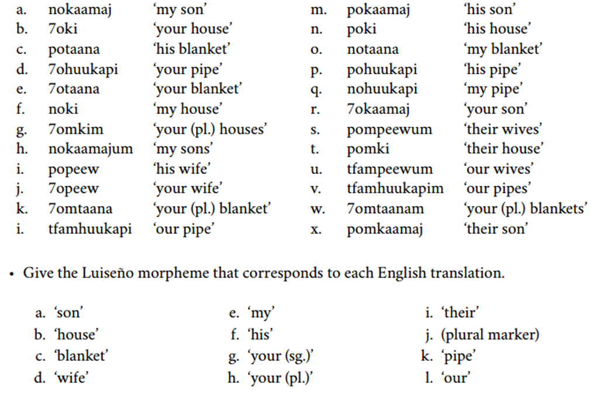

---
## **Dataset 2: Luiseño**
### (Uto-Aztecan, California)
  
.pull-left[
<table style="border-collapse: collapse; border: none; width: auto;">
  <colgroup>
    <col style="width: 2em;">
    <col style="width: 10em;">
    <col style="width: 10em;">
  </colgroup>
  <tr>
    <td>a.</td><td>no<b>kaamaj</b></td><td>'my son'</td>
  </tr>
  <tr>
    <td>h.</td><td>no<b>kaamaj</b>um</td><td>'my sons'</td>
  </tr>
  <tr>
    <td>m.</td><td>po<b>kaamaj</b></td><td>'his son'</td>
  </tr>
  <tr>
    <td>r.</td><td>7o<b>kaamaj</b></td><td>'your son'</td>
  </tr>
  <tr>
    <td>x.</td><td>po<b>kaamaj</b></td><td>'their son'</td>
  </tr>
</table>
]
.pull-right[
<table style="border-collapse: collapse; border: none; width: auto;">
  <colgroup>
    <col style="width: 2em;">
    <col style="width: 10em;">
    <col style="width: 10em;">
  </colgroup>
  <tr>
    <td>b.</td><td><b>7o</b>ki</td><td>'your house'</td>
  </tr>
  <tr>
    <td>d.</td><td><b>7o</b>huukapi</td><td>'your pipe'</td>
  </tr>
  <tr>
    <td>e.</td><td><b>7o</b>taana</td><td>'your blanket'</td>
  </tr>
  <tr>
    <td>j.</td><td><b>7o</b>peew</td><td>'your wife'</td>
  </tr>
  <tr>
    <td>r.</td><td><b>7o</b>kaamaj</td><td>'your son'</td>
  </tr>
</table>
]
   

--
<table style="border-collapse: collapse; border: none; width: auto;">
  <colgroup>
    <col style="width: 2em;">
    <col style="width: 8em;">
    <col style="width: 8em;">
    <col style="width: 2em;">
    <col style="width: 2em;">
    <col style="width: 8em;">
    <col style="width: 8em;">
    <col style="width: 2em;">
    <col style="width: 2em;">
    <col style="width: 8em;">
    <col style="width: 8em;">
  </colgroup>
  <tr>
    <td>a.</td>
    <td>'son'</td>
    <td><b>kaamaj</b</td>
    <td></td>
    <td>e.</td>
    <td>'my'</td>
    <td><b>no-</b</td>
    <td></td>
    <td>i.</td>
    <td>'their'</td>
    <td><b>pom-</b</td>
  </tr>
  <tr>
    <td>b.</td>
    <td>'house'</td>
    <td><b>ki</b</td>
    <td></td>
    <td>f.</td>
    <td>'his'</td>
    <td><b>po-</b</td>
    <td></td>
    <td>j.</td>
    <td>(plural marker)</td>
    <td><b>-um</b / <b>-m</b</td>
  </tr>
  <tr>
    <td>c.</td>
    <td>'blanket'</td>
    <td><b>taana</b</td>
    <td></td>
    <td>g.</td>
    <td>'your (sg.)'</td>
    <td><b>7o-</b</td>
    <td></td>
    <td>k.</td>
    <td>'pipe'</td>
    <td><b>huukapi</b</td>
  </tr>
  <tr>
    <td>d.</td>
    <td>'wife'</td>
    <td><b>peew</b</td>
    <td></td>
    <td>h.</td>
    <td>'your (pl.)'</td>
    <td><b>7om-</b</td>
    <td></td>
    <td>l.</td>
    <td>'our'</td>
    <td><b>tfam-</b</td>
  </tr>
</table>

---
class: center, middle
**HOMEWORK** for morphology will be published over the weekend, and you have one week to finish that.  
**Morphology reading 2** by next Wednesday
   
Slides created via the R package [**xaringan**](https://github.com/yihui/xaringan).
