## **Previously on 201**
  
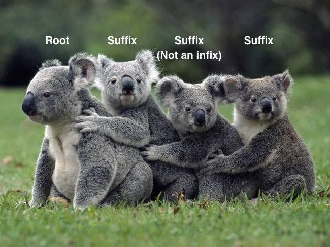

---
## **Previously on 201**
  
.pull-left[
- <b>root</b> (base)  
- <b>affix</b> (morpheme that attaches to the base)  
  - <b>prefix</b>   
  - <b>suffix</b>   
  - <b>infix</b> (rare in English)  
  - <b>circumfix</b>   
- <b>free vs. bound morpheme</b>
  - can appear as an independent word?
]
.pull-right[
- <b>derivational morpheme</b> 
  - change core meaning even part of speech  
- <b>inflectional morpheme</b>
  - add some grammatical nuance  
- <b>homophone</b>
  - same sound, different meanings  
- <b>allomorph</b>
  - same meaning, different sounds  
- <b>simple word vs. compound word</b>
  - one root = simple
  - more than one = compound
]
---
## **Previously on 201**
  
.pull-left[
- <b>root</b> (base; **build**, **flower**)  
- <b>affix</b> (morpheme that attaches to the base)  
  - <b>prefix</b> (**un**-do)  
  - <b>suffix</b> (walk-**ed**)  
  - <b>infix</b> (rare in English)  
  - <b>circumfix</b> (**em**-bold-**en**)  
- <b>free vs. bound morpheme</b>
  - can appear as an independent word?
  - **blue**berry vs. **cran**berry  
]
.pull-right[
- <b>derivational morpheme</b> (piano --> pian-**ist**) 
  - change core meaning even part of speech  
- <b>inflectional morpheme</b> (jump --> jump-**ed**) 
  - add some grammatical nuance  
- <b>homophone</b> (fast-**er**, teach-**er**)
  - same sound, different meanings  
- <b>allomorph</b> (**magic**, **magic**-ian)
  - same meaning, different sounds  
- <b>simple word vs. compound word</b>
  - one root = simple (inter-**nation**-al)
  - more than one = compound (**sawhorse**)
]

---
## **More Terms**
 
### Compounding vs. Affixation
 
**compounding**: combining two or more roots into a single word

- 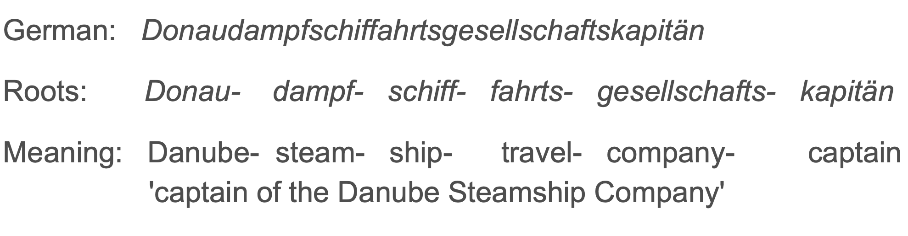

Then the following word in Kazakh is **NOT** compounding:

- 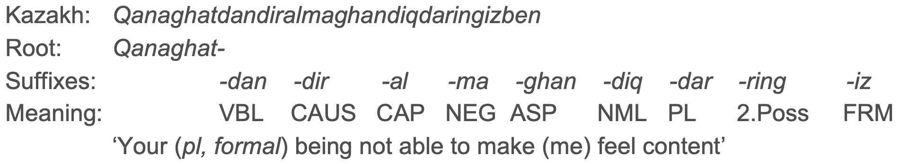

---
## **More Terms**
 
### Reduplication
 
.pull-left[
**full reduplication**: repeat **ALL** of a morpheme
- Indonesian plural
  - *orang* 'person' $\rightarrow$ *orang*-*orang* 'people'
- Chinese intensified adjective:
  - <em>kʰai55ʂin55</em> 'happy' $\rightarrow$ <em>kʰai55kʰai55 ʂin55ʂin55</em> 'very happy'
  

**partial reduplication**: repeat **PART** of a morpheme
- Tagalog future
  - *bili* 'buy' $\rightarrow$ *<b>bi</b>-bili* 'will buy'
- Kazakh intensified adjective:
  - *tætti* 'sweet' $\rightarrow$ *<b>tæp</b>-tætti* 'very sweet'
]
.pull-right[

]

---
## **More Terms**
 
### Alternation, Suppletion, Zero-derivation
 
.pull-left[
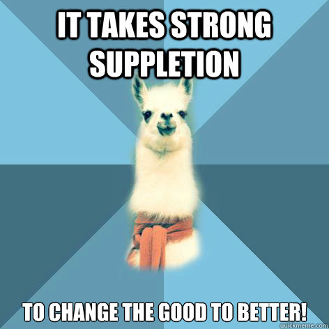
]
.pull-right[
**alternation**: changing one ore more sounds within the morpheme (not the whole morpheme)
  - allomorphy is technically a type of alternation, one in which there is no difference in meaning
  - g**oo**se / g**ee**se; r**i**ng / r**a**ng / r**u**ng
  

**suppletion**: an **inflected** form is phonetically very different from other forms of the same word
  - go / went; good / better / best
    
  
**zero-derivation**: change a word's part of speech **without adding anything** at all
  - 'I ❤️ (heart) Linguistics!'
]

---
## **A Little Practice**
  
Identify the **morphological processes** involved in each of the following words.
  
<b>affixation</b> (prefixation, suffixation), <b>compounding</b>, <b>reduplication</b>, <b>alternation</b>, <b>suppletion</b>
  
.pull-left[
- feed → fed   
- leaf → leaves   
- peace → peaceful   
- foot, ball → football   
- good → best   
- chair, woman → chairwomen   
- back, pack → backpacks   
]
.pull-right[
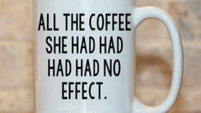   
- like → like-liked   
- go → underwent   
- ox → oxen
]
---
## **Order of Affixation**

### unbelievable vs. renewable
 
.pull-left[
- How many morphemes does each have?   
- What is the root?   
- Is there a prefix or suffix?   
]

.pull-right[

]

--

- they're pretty similar: prefix-**ROOT**-suffix   

--

.pull-left[
- **BUT BUT BUT**
  - Is it un + believable or unbelieve + able?
  - Is it renew + able or re + newable?
]

--
.pull-right[
**believ**-able vs. un-**believe**   
re-**new** vs. **new**-able
]

---
## **Order of Affixation**
  
**ORDER OF AFFIXATION**: the order in which you add affixes to a root   

It does play a role in the morphology of a word:   
  - different words have different orders of affixation (un + believable / renew + able)  
  - order of affixation is part of our mental grammar   
  - to **test** the order: we **add** an affix and see if it makes a real word  
  - also, to **test** the order: we try to **understand** what the word means  
    - If the definition involves some **smaller** combination of the root and an affix, it suggests that that affix is added first (un-[**believ**-able])   
  - Neither of these tests works 100% of the time, so you should try a combination of them

---
## **Hierarchical Structure**
  
.pull-left[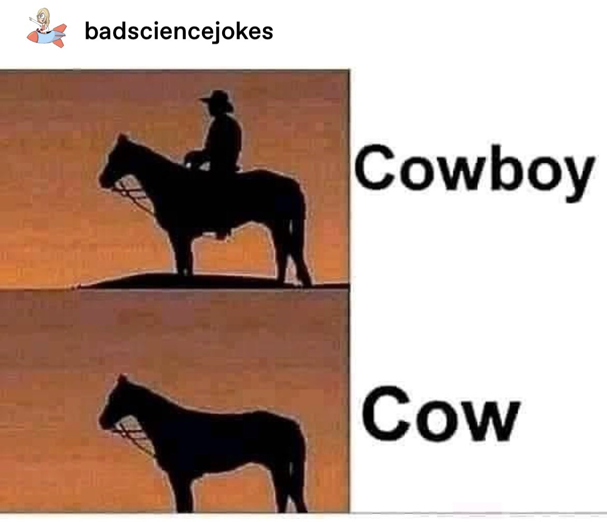]
.pull-right[
- Order of affixation is somehow connected to the **meaning** of a word
- The fact that we can't add affixes in any old order suggests that words have a **hierarchical structure**
We can visualize this structure with a **tree diagram**.
- We start at the bottom with the root and build upward, adding affixes until we get to the full word at the top
- An alternative is **labeled bracketing**, which is more compact but perhaps less intuitive:
  
[Adj un [Adj [V believe ] able ] ]
  
[Adj [V re [Adj new ] ] able ]

]
---
## How to draw a morphological tree 
### **De-humid-ify-er**
 
1. Identify the word's morphemes and write them out separately in one row
2. Identify the root (or roots) and label its **part of speech**
3. Look at the morphemes immediately before and after the root. **Which one is added first**? Draw lines upward connecting them, and label the new word's part of speech
4. This new word becomes the base you'll keep building off of. **Repeat step 3** using this new base instead of the root, and continue until you have no unconnected morphemes left
  

--
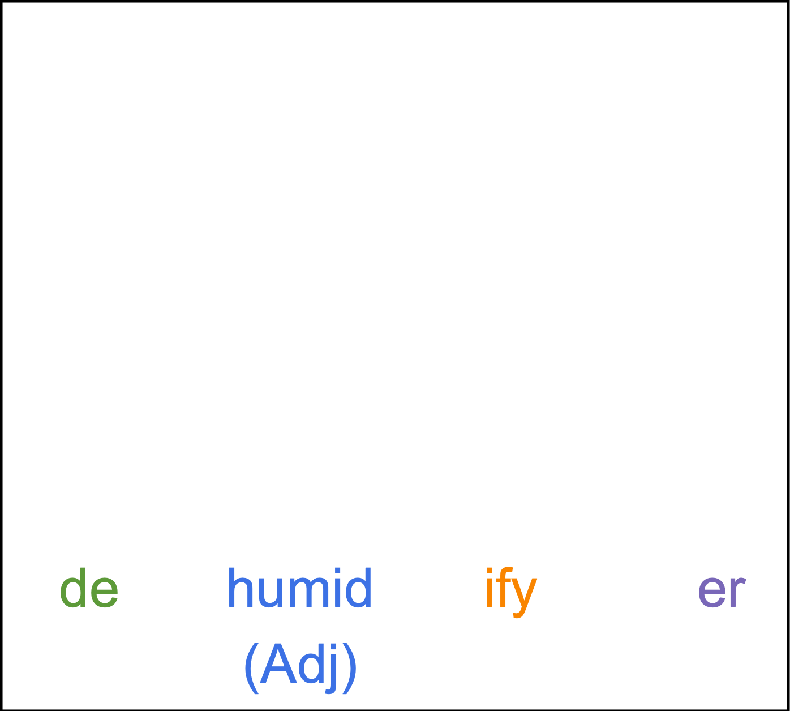

--
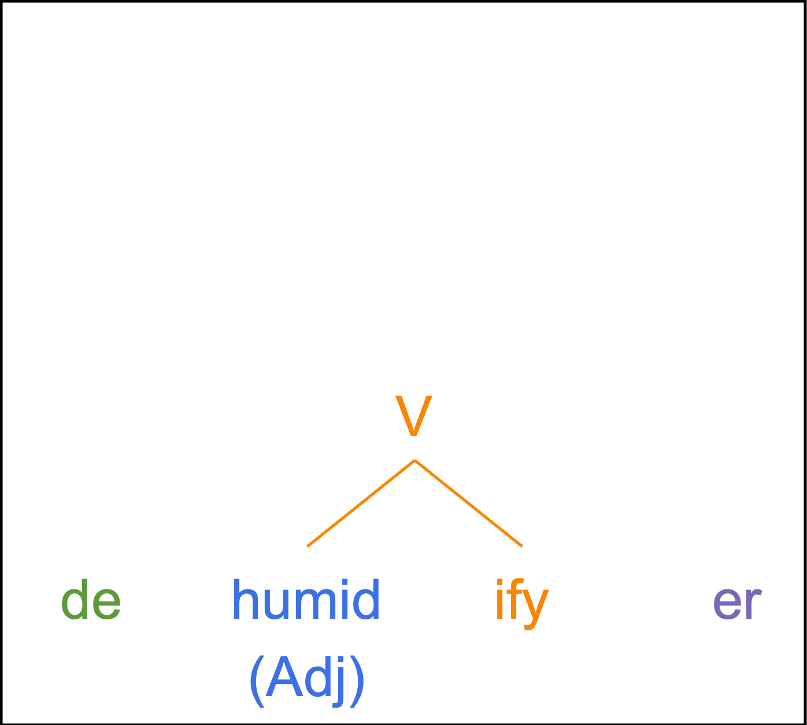

--
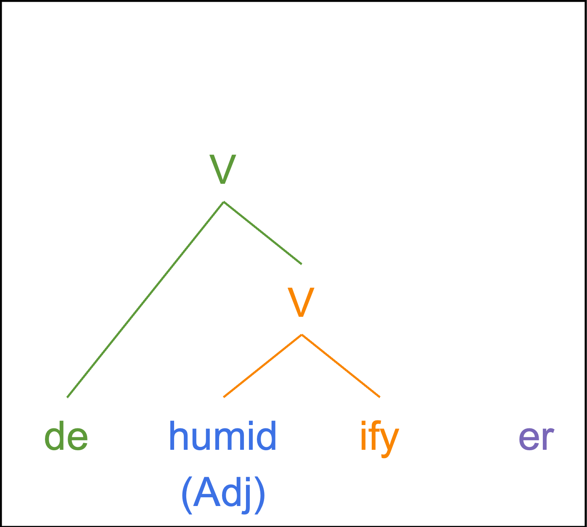

--
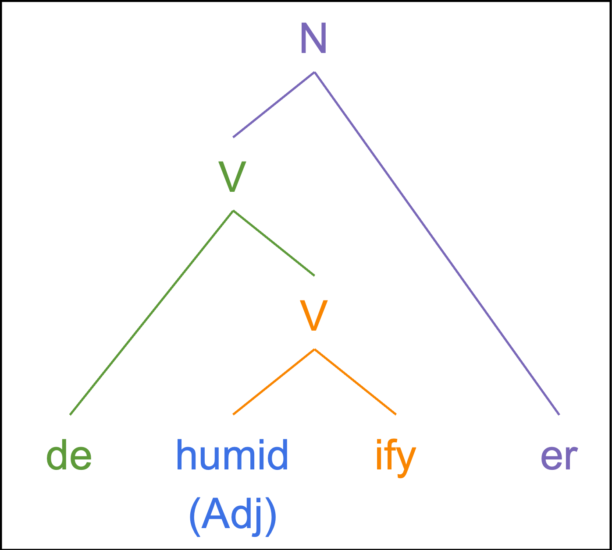
---
## Practice: Hierarchical structure
 
.pull-left[
Draw a **tree** or give **bracket labeling** for the following words:   
1. disappearance   
2. silliness   
3. unthinkable   
4. overgeneralisation   
5. internationalism
]

.pull-right[
**HINTS**  
- find the root and move outward/upward   
- mark the part of speech at every step   
- If adding an affix makes a non-word, try adding another affix instead   
- If adding an affix makes something that seems unrelated to the overall word's meaning, try adding a different affix instead
]

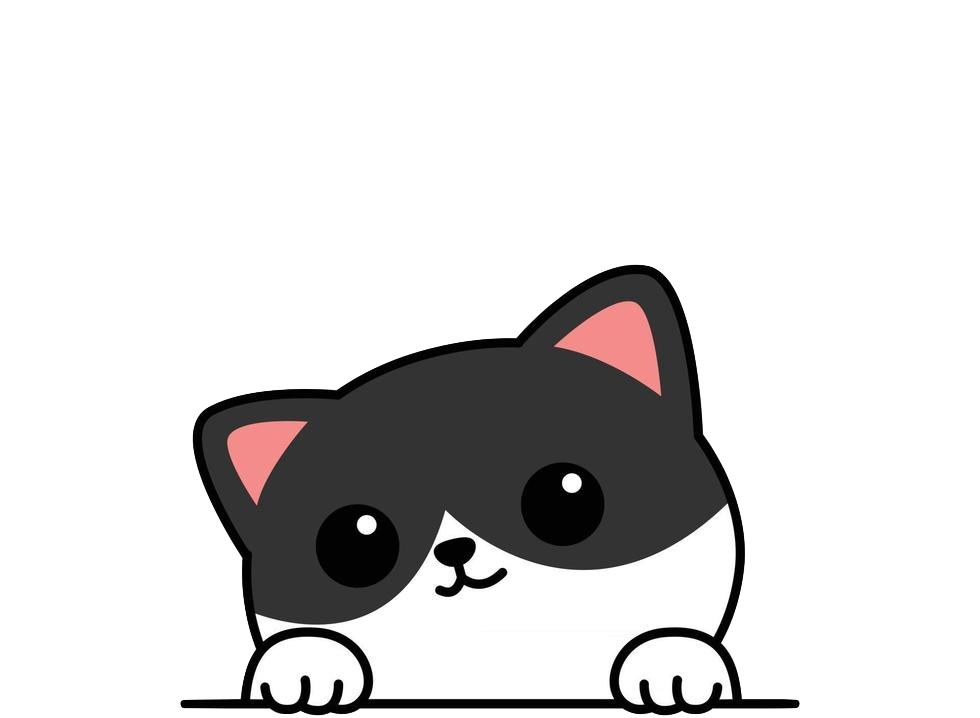
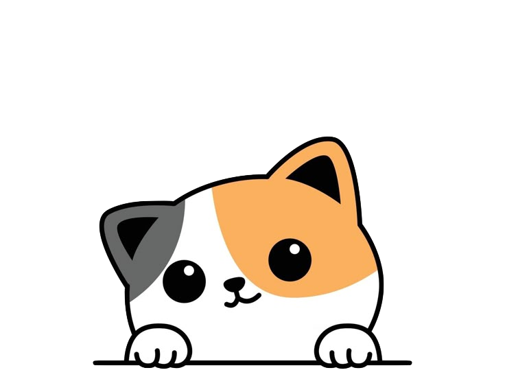
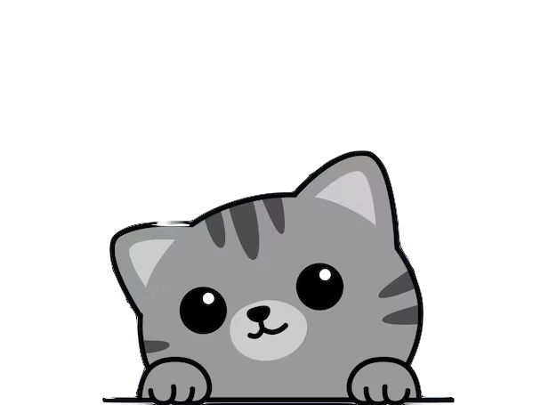

---
## **Undoable**
 
.pull-left[
- What does **undoable** mean?   
- *undo* + *able* vs. *un* + *doable*  
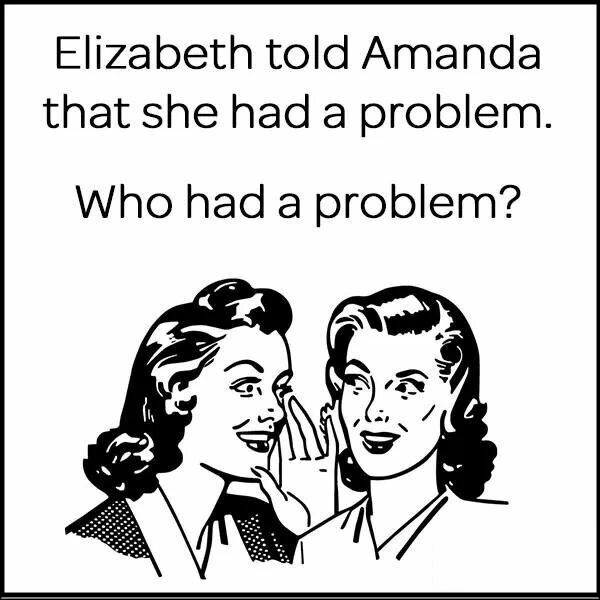
]
--
.pull-right[
- This is an example of a word with an **ambiguous structure**  
- Depending on the structure you assign it, it has a **different meaning**  
- both meanings are acceptable   
- The **meaning** of words is directly affected by their morphological structure  
- That's why **structure** is very important:
  - Without knowing the structure, we wouldn't know how to put together the meanings of a word's different morphemes to create the full word.
]

---
## **Undoable**
  
.pull-left[
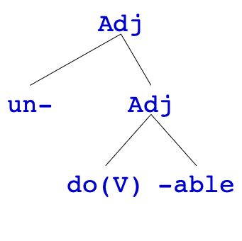

]
.pull-right[
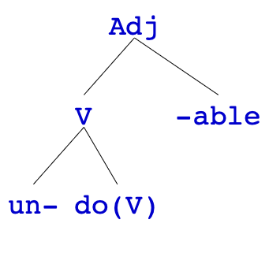

]

---
## Practice: Ambiguous Structures
 
.pull-left[
Are the following words ambiguous? If yes, provide **labeled bracketings** for both readings and explain what each reaching means. If no, explain why not.  
1. immeasurable   
2. unwrappable   
3. unbearable   
]
.pull-right[

]

---
class: center, middle
**HOMEWORK I** is due this Sunday  
**HOMEWORK II** will be published during this weekend, you have one week to submit  
**Syntax reading 1** by next Wednesday  

  
Slides created via the R package [**xaringan**](https://github.com/yihui/xaringan).
