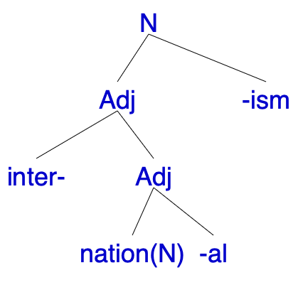
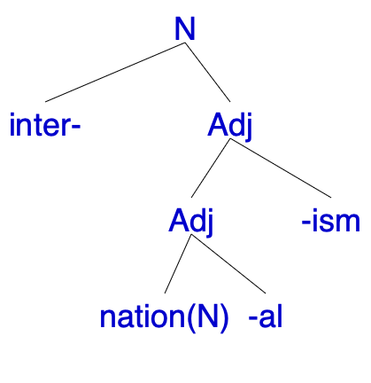
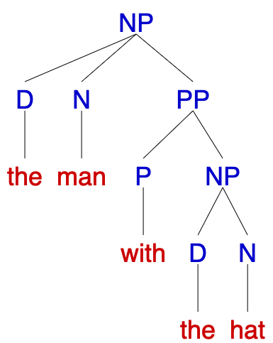
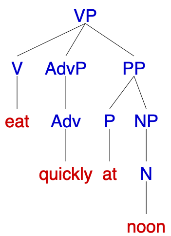
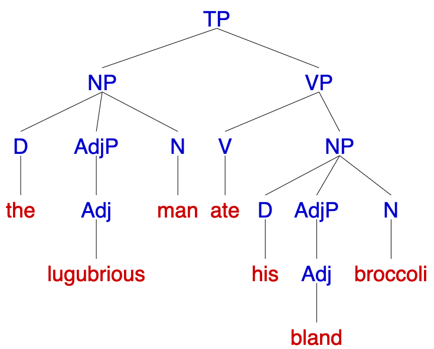

## **Previously on 201**
.pull-left[
 

  
**compounding**: blackbird / black bird   
**reduplication** partial vs. full   
**alternation** / **suppletion** / **zero-derivation**

]

.pull-right[
 

The firework never got soaked. It is **[inflame]**-<b>able</b>.

  
 

It seems we don't have this meaning in OED...
]

---
## **Previously on 201**
  
### INTER-NATION-AL-ISM
 
.pull-left[

why it is this **one**,
]
.pull-right[

but **NOT** this one?
]

---
class: center, middle

### What is the **basic** unit in Morphology?   

--
### <b>MORPHEME</b>  

--
### What happens if **larger** units were built?  

--
### <b>SYNTAX</b>  

--
**Morphology** cares about word <u><b>structure</b></u>  
**Syntax** cares about sentence <u><b>structure</b></u>

---
## **Constituents**: basic structure in syntax
 
.pull-left[
**constituent**: a group of words that <b>acts together</b> as a **unit**   
- Consider the following sentences. What is the **subject** of each sentence?  
1. *Francisco <b>studies linguistics</b>.*
2. *The tall boy <b>studies linguistics</b>.*
3. *The tall boy from New Jersey <b>studies linguistics</b>.*
4. *The tall boy named Francisco <b>studies linguistics</b>.*
5. *The tall boy that I met last week <b>studies linguistics</b>.*  
]

.pull-right[

   

[**a video on constituent**](https://www.youtube.com/watch?v=Ia7d4slVL6s)
]

---
## **Constituents**: basic structure in syntax
 
.pull-left[
**constituent**: a group of words that <b>acts together</b> as a **unit**   
- Consider the following sentences. What is the **subject** of each sentence?  
1. *<u>Francisco</u> <b>studies linguistics</b>.*
2. *<u>The tall boy</u> <b>studies linguistics</b>.*
3. *<u>The tall boy from New Jersey</u> <b>studies linguistics</b>.*
4. *<u>The tall boy named Francisco</u> <b>studies linguistics</b>.*
5. *<u>The tall boy that I met last week</u> <b>studies linguistics</b>.*   

- SUBJECT can be **one** or **many** words, but they all <b>act together</b> to describe a single concept
]

.pull-right[

   

[**a video on constituent**](https://www.youtube.com/watch?v=Ia7d4slVL6s)
]

---
background-image: url("../pic/0926/video.png")
background-size: contain
baground-position: center

---
## **Phrases**: types of constituents
 
.pull-left[
- Each phrase has a main word or **head**  

- Phrases are named after the head word's **part of speech** (PoS):  
  - **noun phrase** (<b>NP</b>): *<u>man</u>, the <u>man</u>, the happy <u>man</u>, the <u>man</u> with the hat*  
  - **prepositional phrase** (<b>PP</b>): *<u>into</u> the forest, <u>by</u> the author, <u>for</u> good luck*  
  - **verb phrase** (<b>VP</b>): *<u>eats</u>, <u>eats</u> pizza, <u>eats</u> quickly, <u>eats</u> pizza quickly at noon*  
  - **adjective phrase** (<b>AdjP</b>): *<u>happy</u>, <u>ugly</u>*  
  - **adverb phrase** (<b>AdvP</b>): *<u>quickly</u>, <u>happily</u>*
]
  
.pull-right[
- **one constituent can contain another**:  
  - <u>*the man with the hat*</u> (<b>NP</b>) contains <u>*with the hat*</u> (<b>PP</b>), which contains <u>*the hat*</u> (<b>NP</b>)  
  - <u>*eats quickly at noon*</u> (<b>VP</b>)contains <u>*quickly*</u> (<b>AdvP</b>) and <u>*at noon*</u> (<b>PP</b>)  
&nbsp;&nbsp;&nbsp;

]
  
---
background-image: url("../pic/0926/video1.png")
background-size: contain
baground-position: center

---
## **Constituency Tests**
  
.pull-left[
- There are four tests to **identify** whether a group of words IS a **constituent** or NOT:   
  - Replacement (substitution) test   
  - Movement test   
  - Stand-alone test   
  - Coordination test   
- **These don't work 100% of the time**, and some tests work better with some sentences. Hence, you might have to try several
]
.pull-right[

]
 
### *<b>[The lugubrious man]</b>* ate *<b>[his bland broccoli]</b>*.

---
## **Replacement (Substitution) Test**
 
### *<b>[The lugubrious man]</b>* ate *<b>[his bland broccoli]</b>*.
 
.pull-left[
- **replacement**: replace a group of words with a **pro-form**. If it works, they are one constituent   
- **pro-from**: <u>pronoun</u> or other generic expression like <u>there</u>, <u>like that</u>, <u>do</u>, <u>do that</u>, <u>that way</u>  
  - *[The lugubrious man] ate his bland broccoli* → *[He] ate his bland broccoli.*   
  - *The lugubrious man [ate his bland] broccoli* → *The lugubrious man [???] broccoli.*  
  - Try the replacement test with  [bland broccoli], [the lugurbious] and [man ate]
]
.pull-right[
   
'*The lugubrious man ate his bland broccoli*.'
]
---
## **Movement Test**
 
### *<b>[The lugubrious man]</b>* ate *<b>[his bland broccoli]</b>*.
 
.pull-left[
- **movement test**: move a group of words to a different part of the sentence  
- You may have to add **extra** words to support this movement  
  - → *The person who <u>ate his bland broccoli</u> is [the lugubrious man]*.  
  - → \* *<u>Man</u> who <u>ate his bland broccoli</u> is [the lugubrious]*.  
  - Try the movement test with [his bland broccoli], [his bland] and [man ate]
]
.pull-right[
   
'*The lugubrious man ate his bland broccoli*.'
]

---
## **Movement Test Bonus**
 
### *<b>[The dog]</b>* ate *<b>[the sandwich]</b> <b>[today]</b>*.
### *<b>[Today]</b> <b>[the dog]</b>* ate *<b>[the sandwich]</b>*.

.pull-left[
 
How do we know whether it was <b>'today'</b> moved or <b>'the dog ate the sandwich'</b>?
  

]

--
.pull-right[
   
'*The dog ate the sandwich today*.'
]

---
## **Stand Alone Test**
 
### *<b>[The lugubrious man]</b>* ate *<b>[his bland broccoli]</b>*.
 
.pull-left[
- **stand alone test**: come up with a question that can be answered by just saying the group of words you want to test **on its own**   
  - → *Who <u>ate his bland broccoli</u>?* 
  *[the lugubrious man]!*   
  - Try the stand alone test with [his bland broccoli], [the lugubrious] or [man ate]?
]
.pull-right[
   
'*The lugubrious man ate his bland broccoli*.'
]

---
## **Coordination Test**
 
### *<b>[The lugubrious man]</b>* ate *<b>[his bland broccoli]</b>*.
 
.pull-left[
- **coordination test**: coordinating conjunctions like <b>and</b> or <b>or</b> will always join two words or phrases of **the same type**  
- If a group of words is a constituent, we are able to insert another phrase of the same type joined with <b>and</b> or <b>or</b>   
  - → *[the lugubrious man] and [Rumpelstilzchen] <u>ate</u> their <u>bland broccoli</u>*.  
  - Try the coordination test with [his bland broccoli], [man ate] and [his bland]
]
.pull-right[
   
'*The lugubrious man ate his bland broccoli*.'
]
---
## **Practice**
 
.pull-left[
   
]
.pull-right[
Use **constituency tests** to determine whether the underlined part is a **constituent** in each sentence:  
1. <u>The tragedy</u> upset the entire family.   
2. They hid <u>in the cave</u>.   
3. The <u>computer was very</u> expensive.   
4. The geese <u>swam across</u> the lake.   
5. Mary gave <u>a book to her sister</u>.   
6. Linda read <u>a book about geology</u>.
]

---
class: center, middle
**HOMEWORK II** is due this Sunday  
**HOMEWORK III** will be published during this weekend, you have one week to submit  
**Syntax reading 2** by next Wednesday  

  
Slides created via the R package [**xaringan**](https://github.com/yihui/xaringan).
