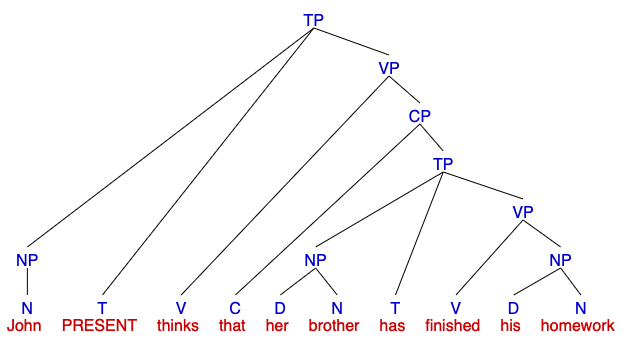
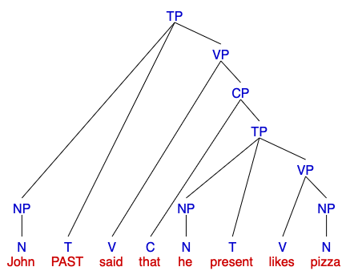
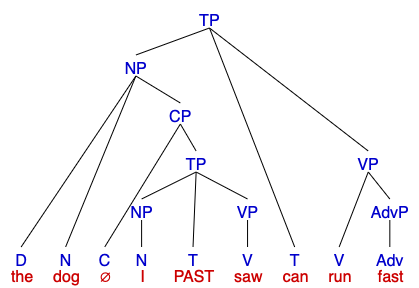
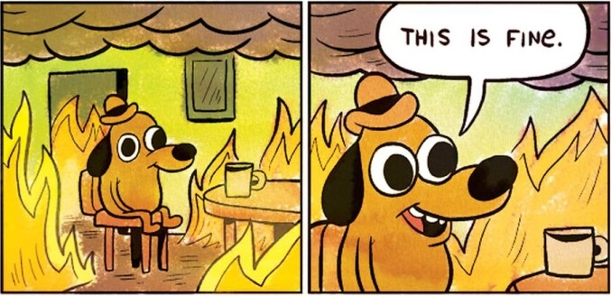

## **Previously on 201**
### Movement test
 
- If you can move a string of words **together to another place** in a sentence while meaning about the same thing, the string is a constituent.   
  - **Clefting**: putting the string of words between <b>it was</b>/<b>it is</b> and a <b>that</b>/<b>who</b>/<b>who</b> at the beginning of the sentence  
  - **Preposing**:  putting the string of words before a <b>is</b>/<b>are</b> <b>what</b> or <b>is</b>/<b>are</b> <b>who</b> at the beginning of the sentence  

.pull-left[
- She bought <b><u>a brand new car</u></b>.  
  - **Clefting**: <b>It was</b> <b><u>a brand new car</u></b> that she bought.
  - **Preposing**: <b><u>A brand new car</u></b> <b>was what</b> she bought.
]
.pull-left[
- She <b><u>bought a brand</u></b> new car.  
  - **Clefting**: **\* **<b>It was</b> <b><u>bought a brand</u></b> that she (did) new car...
  - **Preposing**: **\* **<b><u>Bought a brand</u></b> <b>was what</b> she (did) new car...
]

---
## **Previously on 201**
### Movement test
 
- If you can move a string of words **together to another place** in a sentence while meaning about the same thing, the string is a constituent.   
  - **Clefting**: putting the string of words between <b>it was</b>/<b>it is</b> and a <b>that</b>/<b>who</b>/<b>who</b> at the beginning of the sentence  
  - **Preposing**:  putting the string of words before a <b>is</b>/<b>are</b> <b>what</b> or <b>is</b>/<b>are</b> <b>who</b> at the beginning of the sentence  

.pull-left[
- They played <b><u>in the garden</u></b>. 
  - <b><u>in the garden</u></b> is a constituent  

- They <b><u> played in the garden</u></b>. 
  - <b><u>played in the garden</u></b> is a constituent

]
.pull-left[
- They <b><u>studied for the exam</u></b> in the library. 
  - <b><u>studied for the exam</u></b> is a constituent  

- They <b><u>studied for</u></b> the exam in the library. 
  - <b><u>studied for</u></b> is not a constituent
]

---
## **Previously on 201**
 
###**constituent**: a group of words that <b>acts together</b> as a **unit**   

### **phrases**: types of constituents
 
- Each phrase has a main word or **head**, and they are named after the **head** word's **part of speech** (PoS):  
  - **noun phrase** (<b>NP</b>): *<u>man</u>, the <u>man</u>, the happy <u>man</u>, the <u>man</u> with the hat*  
  - **prepositional phrase** (<b>PP</b>): *<u>into</u> the forest, <u>by</u> the author, <u>for</u> good luck*  
  - **verb phrase** (<b>VP</b>): *<u>eats</u>, <u>eats</u> pizza, <u>eats</u> quickly, <u>eats</u> pizza quickly at noon*  
  - **adjective phrase** (<b>AdjP</b>): *<u>happy</u>, <u>ugly</u>*  
  - **adverb phrase** (<b>AdvP</b>): *<u>quickly</u>, <u>happily</u>*
  
---
## **Phrase Structure Rules** (PSRs)
 
There are (descriptive) rules that indicate **how phrases are built out of smaller units** (which could be words or other phrases)  
  - These rules are called **phrase structure rules**   
  - They indicate the order and position of the smaller units in a phrase   

We derive these rules by observing what are the possible structures that exist in natural language  

.pull-left[
  
<h3><b>NP</b> → (D) (AdjP+) N (PP)</h3>
]

.pull-right[

]

---
## Notaional Notes
 
Phrase structure rules indicate the **order** and **position** of the sub-parts.
  
.pull-left[

]
.pull-right[
<h3><b>NP</b> → (D) (AdjP+) N (PP)</h3> 

]

---
## **Phrase Structure Rules for English**
 
.pull-left[
- <h3><b>NP</b> → (D) (AdjP+) <b>N</b> (PP+)</h3> 
- <h3><b>PP</b> → <b>P</b> NP</h3> 
- <h3><b>AdjP</b> → (AdvP) <b>Adj</b></h3> 
- <h3><b>AdvP</b> → (AdvP) <b>Adv</b></h3> 
]
.pull-right[
- <h3><b>TP</b> → NP <b>(T)</b> VP</h3> 
- <h3><b>CP</b> → <b>C</b> TP</h3> 
]
- <h3><b>VP</b> → (AdvP+) <b>V</b> (NP) (NP) (AdvP+) (PP+) (AdvP+)</h3>

---
.pull-left[
## **Practice**
### NP, PP, AdjP, AdvP
 
Draw a syntax tree for the underlined phrases.   
a. I ate <u>an apple</u>.  
b. Don't stare at <u>the bright sun</u>.  
c. John went <u>into the building</u>.  
d. They're like <u>peas in a pod</u>.  
e. The bakery sells <u>wonderfully fresh bread</u>.  
f. I like to drive <u>really slowly</u>.  
g. Mary helped <u>the man in the car with the flat tire</u>.  
h. I threw a ball to <u>the dog with a collar in the park</u>.
]
.pull-right[

    

   
In **g** does *with the flat tire* modify 'the man' or 'the car'? What about *in the park* in **h**?
]
---
.pull-left[
## **Practice**
### NP, PP, AdjP, AdvP
 
### b. <u>the bright sun</u>
]
.pull-right[
]
  
--

--

--

--

---
.pull-left[
## **Practice**
### NP, PP, AdjP, AdvP
]
.pull-right[
]
  
.pull-left[
.pull-left[

]
.pull-right[

]
]
.pull-right[
.pull-left[

]
.pull-right[

]
]
  
.pull-left[
.pull-left[
c. '*into the building*'
]
.pull-right[
d. '*peas in a pod*'
]
]
.pull-right[
.pull-left[
e. '*wonderfully fresh bread*'
]
.pull-right[
f. '*really slowly*'
]
]
---
.pull-left[
## **Practice**
### NP, PP, AdjP, AdvP
 
**g. the man in the car with the flat tire**
  

]
.pull-right[

  

]
  
Think about why it is the tree on the **left**, not the one on the **right** (both trees are correct according to PSRs).

---
## Quick Notes
 
**h. I throw a ball to the dog with a collar in the park.**
1. draw an AdjP for **each** adjective, an AdvP for **each** adverb   
2. if X modifies Y, X must be a child of the same parent as Y   
.pull-left[

]
.pull-right[

]
 
- So here on the **LEFT**, PP is under a NP, which means this PP modifies the **head N** (dog) in the NP (dog is in the park);and on the **RIGHT**, PP is under a VP, which means this PP modifies the **head V** (threw) in the VP (thowing happens in the park). This is where sometimes there is **AMBIGUITY**! It is because of PP can be under either an NP or a VP according to our **phrase structure rules**.

---
### **Tense Phrases (TP)**
 
**Sentences** are labeled as tense phrases. In many cases, we can split a sentence into a **NP** and a **VP**
  
.pull-left[
- <h3><b>TP</b> → NP <b>(T)</b> VP</h3>
 
The **head** of a TP is the **T(ense)** node  
It can be occupied by:   
  - overt **auxiliaries** (is, was, are, will, have...)  
  - **modals** (can, could...), or  
  - infinitive marker **to**  
  - abstract **present/past tense**]
.pull-right[
  
'*Tina will escape.*'
  
  
'*Tina escaped.*'
]

---
.pull-left[
## **Practice**
### VP, TP
 
Draw a syntax tree for the following sentences.
  
a. The robin caught a worm.  
b. The mockingbird was singing.  
c. The sparrow on the windowsill chirped loudly.  
d. The osprey brought its hungry chicks a fish.  
e. The large owl lives in a nest in the barn.  
f. The duck quickly led her ducklings across the street.  
]
.pull-right[

        
**challenge**: The irritable bluejay noisily warned the other small birds about the very large circling hawk in the clear sky.]

---
## **Practice**
### VP, TP
  
.pull-left[

]
.pull-right[

]
  
.pull-left[
a. '*The robin caught a worm*.'
]
.pull-right[
b. '*The mockingbird was singing loudly*.'
]

---
## **Practice**
### VP, TP
  
.pull-left[

]
.pull-right[

]
  
.pull-left[
c. '*The sparrow on the windowsill chirped loudly*.'
]
.pull-right[
d. '*The osprey brought its hungry chicks a fish*.'
]

---
## **Practice**
### VP, TP
  
.pull-left[

]
.pull-right[

]
  
.pull-left[
e. '*The large owl lives in a nest in the barn*.'
]
.pull-right[
f. '*The duck quickly led her ducklings across the street*.'
]

---
## **Practice**
### VP, TP
 

  
**☆** '*The irritable bluejay noisily warned the other small birds about the very large circling hawk in the clear sky*.'

---
## **Practice**
### VP, TP
 

  
**☆** '*The irritable bluejay noisily warned the other small birds about the very large circling hawk in the clear sky*.'

---
### **Complementiser Phrases (CP)**
 
.pull-left[
Consider the following sentence:   
  - Tina thinks <u>that her brother has finished his homework</u>.  
  
Is the underlined string a constituent?  
  - <u>That her brother has finished his homework</u> is what Tina thinks.
  - What does Tina think? <u>That her brother has finished his homework</u>.  
  
**CP**s are sentences preceded by a complementiser: 
- <h3><b>CP</b> → <b>C</b> TP</h3>]

--
.pull-right[

  
*'that her brother has finished his homework'*
]

---
## **Revised VP**
  
.pull-left[
<h3><b>VP</b> → (AdvP+) <b>V</b> (NP) 
<b>(NP)</b> (AdvP+) (PP+) (AdvP+)</h3>
  
<h3><b>VP</b> → (AdvP+) <b>V</b> (NP) 
<b>({NP, CP})</b> (AdvP+) (PP+) (AdvP+)</h3>
]
.pull-right[

]

---
.pull-left[
## **Practice**
### complex sentences
 
Identify the **complementiser** (if any) in each of these sentences, and determine whether:
  - the CP is **acting as** an NP, AdvP, or AdjP
  - the CP it is **being inserted into** an NP or a VP.   
a. John said that he likes pizza.  
b. The dog I saw can run fast.  
c. I will take an umbrella if it rains.  
d. I am studying because I am taking a test tomorrow.  
e. I saw a deer that was grazing in the park.  
f. I want to go to California.  
]
.pull-right[

  

  
'*John said that he likes pizza*.'
]

---
## **Practice**
### complex sentences
  
.pull-left[
  
'*The dog I saw can run fast*.'
]
.pull-right[
  
'*I will take an umbrella if it rains*.'
]
---
## **Part 1, Homework 2**
 
.pull-left[
a. maen mixunaem

b. maen ketab nemixunaem

c. shoma ketab mixunid

d. shoma ketab nexundid

e. maen ketab xundaem

f. maen nexundaemesh
]
.pull-right[
‘I am reading.’

‘I am not reading a book.’

‘You are reading a book.’

‘You did not read a book.’

‘I read (past tense) a book.’

‘I did not read it.’
]

___

.pull-left[
1.	‘read’ 
2.	‘book’ 
3.	negation (‘not’) 
4.	1st person (‘I’) 
5.	2nd person (‘you’) 
6.	‘it’ 
7.	present progressive tense 
8.	past tense 
]
.pull-right[
i.	‘I am reading a book.’  
ii.	‘I am not reading.’  
iii.	‘You read (past tense) a book.’  
iv.	‘You are reading it.’
]
---
## **Part 1, Homework 2**
 
.pull-left[
a. maen mixunaem

b. maen ketab nemixunaem

c. shoma ketab mixunid

d. shoma ketab nexundid

e. maen ketab xundaem

f. maen nexundaemesh
]
.pull-right[
‘I am reading.’

‘I am not reading a book.’

‘You are reading a book.’

‘You did not read a book.’

‘I read (past tense) a book.’

‘I did not read it.’
]

___

.pull-left[
**step 1**, compare:
  - a. maen ketab nemixunaem
  - b. maen ketab nemixunaem 
  
**result**: now we know, ketab and ne are <b>*book*</b> and <b>*not*</b>, but we don't know which one is which
]
.pull-right[
**step 2**, compare:
  - b. maen ketab nemixunaem
  - c. shoma ketab mixunid  

**result**: now we know ketab is <b>*book*</b> and ne is <b>*not*</b>  

why don't we compare b and d?
]

---
## **Part 1, Homework 2**
 
.pull-left[
a. maen mixunaem

b. maen ketab nemixunaem

c. shoma ketab mixunid

d. shoma ketab nexundid

e. maen ketab xundaem

f. maen nexundaemesh
]
.pull-right[
‘I am reading.’

‘I am not reading a book.’

‘You are reading a book.’

‘You did not read a book.’

‘I read (past tense) a book.’

‘I did not read it.’
]

___

.pull-left[
**step 3**, compare all sentences with maen and all sentences with shoma  

**result**: now we know maen is <b>*I*</b> and shoma is <b>*you*</b>  
]

.pull-right[
**step 4**, compare:
  - a. maen mixunaem
  - c. shoma ketab mixunid  

**result**: now we know mixun is <b>*am/are reading*</b>
]

---
## **Part 1, Homework 2**
 
.pull-left[
a. maen mixunaem

b. maen ketab nemixunaem

c. shoma ketab mixunid

d. shoma ketab nexundid

e. maen ketab xundaem

f. maen nexundaem**esh**
]
.pull-right[
‘I am reading.’

‘I am not reading a book.’

‘You are reading a book.’

‘You did not read a book.’

‘I read (past tense) a book.’

‘I did not read it.’
]

___

.pull-left[
**step 5**, compare:
  - a. maen mixunaem
  - e. maen ketab xundaem  

**result 1**: now we know mixun is <b>*am/are reading*</b> and xund is <b>*read (past_tense)*</b> 

**result 2**: we also know that xun is <b>*read*</b>, mi is <b>*present progressive tense*</b> and d is is <b>*past tense*</b>
]

.pull-right[
**step 6**, compare:
  - b. maen ketab nemixunaem
  - f. maen nexundaem**esh**
  
 

**result**: the only difference now tells us that **esh** is <b>*it*</b>
]

---
## **Part 1, Homework 2**
 
.pull-left[
a. maen mixun<b><u>aem</b></u>

b. maen ketab nemixun<b><u>aem</b></u>

c. shoma ketab mixun<b><u>id</b></u>

d. shoma ketab nexund<b><u>id</b></u>

e. maen ketab xund<b><u>aem</b></u>

f. maen nexund<b><u>aem</b></u>**esh**
]
.pull-right[
‘I am reading.’

‘I am not reading a book.’

‘You are reading a book.’

‘You did not read a book.’

‘I read (past tense) a book.’

‘I did not read it.’
]
___

**step 7**: check whether what we currently assume is working   

- **yet do we finish everything?** nope, we still have <b><u>aem</b></u> and <b><u>id</b></u> to figure out  

- it seems they are not **tense**-related, since in **a** and **e** (or **c** and **d**), <b><u>aem</b></u> (or <b><u>id</b></u>) can occur either in *present progressive tense* or in *past tense*  

But we find that <b><u>aem</b></u> only occurs together with maen, and <b><u>id</b></u> only with shoma, so they are also **person**-related

---
## **Part 1, Homework 2**
 
.pull-left[
a. maen mixun<b><u>aem</b></u>

b. maen ketab nemixun<b><u>aem</b></u>

c. shoma ketab mixun<b><u>id</b></u>

d. shoma ketab nexund<b><u>id</b></u>

e. maen ketab xund<b><u>aem</b></u>

f. maen nexund<b><u>aem</b></u>**esh**
]
.pull-right[
‘I am reading.’

‘I am not reading a book.’

‘You are reading a book.’

‘You did not read a book.’

‘I read (past tense) a book.’

‘I did not read it.’
]

___

.pull-left[
.pull-left[
1.	‘read’ 
2.	‘book’ 
3.	negation (‘not’) 
4.	1st person (‘I’) 
5.	2nd person (‘you’) 
6.	‘it’ 
7.	pres. progressive 
8.	past 
]
.pull-right[
xun 
ketab 
ne- 
maen & <b><u>-aem</b></u> 
shoma & <b><u>-id</b></u> 
**-esh** 
mi- 
-id 
]
]
.pull-right[
i.	‘I am reading a book.’ 
i.maen ketab mi-xun<b><u>-aem</b></u> 
ii.	‘I am not reading.’ 
i.maen ne-mi-xun<b><u>-aem</b></u> 
iii.	‘You read (past tense) a book.’ 
i.shoma ketab xun-d<u>-id</b></u> 
iv.	‘You are reading it.’ 
i.shoma mi-xun<b><u>-id</b></u>**-esh**
]
---
class: center, middle
**HOMEWORK III** is due this Sunday  
**Mid-term**: next Friday 10:20 - 11:40 am, Oct 10, 2025 at [**ED-025B**](https://dcs.rutgers.edu/classrooms/graduate-school-education-room-025b) (clickable)  

  
Slides created via the R package [**xaringan**](https://github.com/yihui/xaringan).
