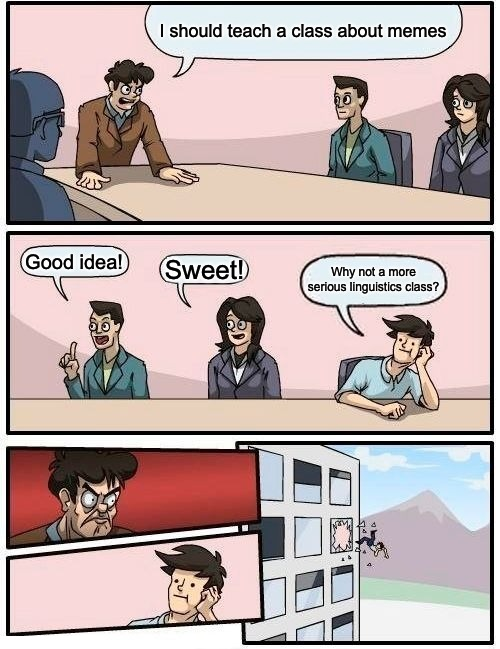
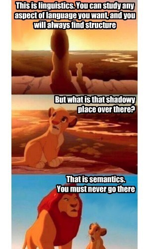
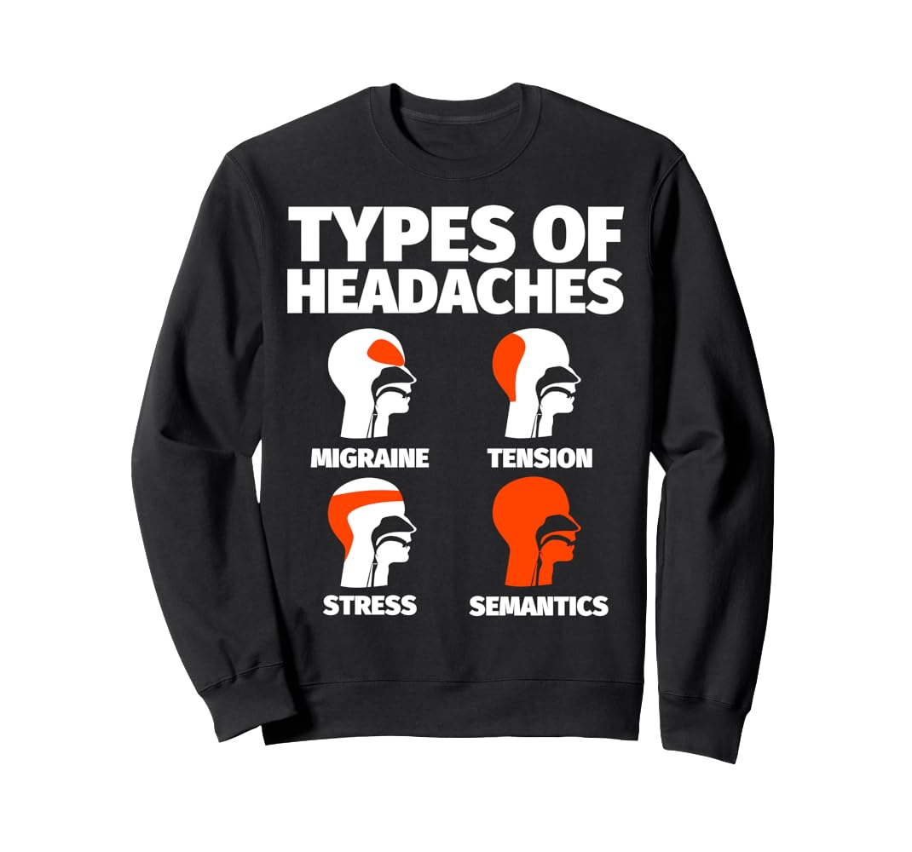
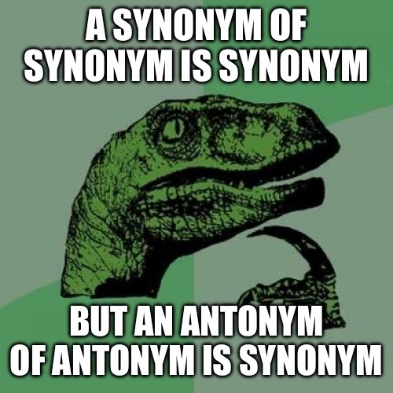
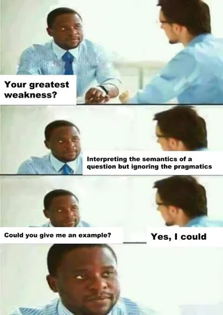
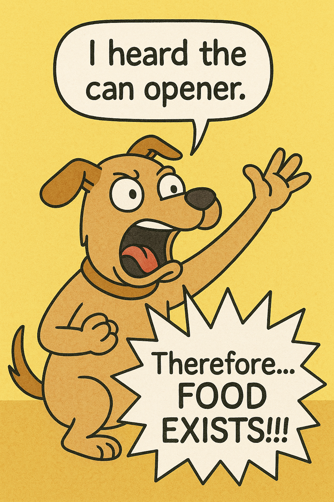
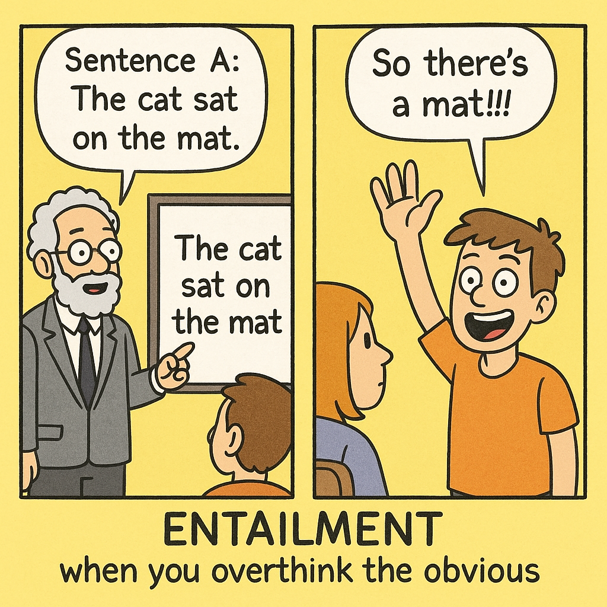
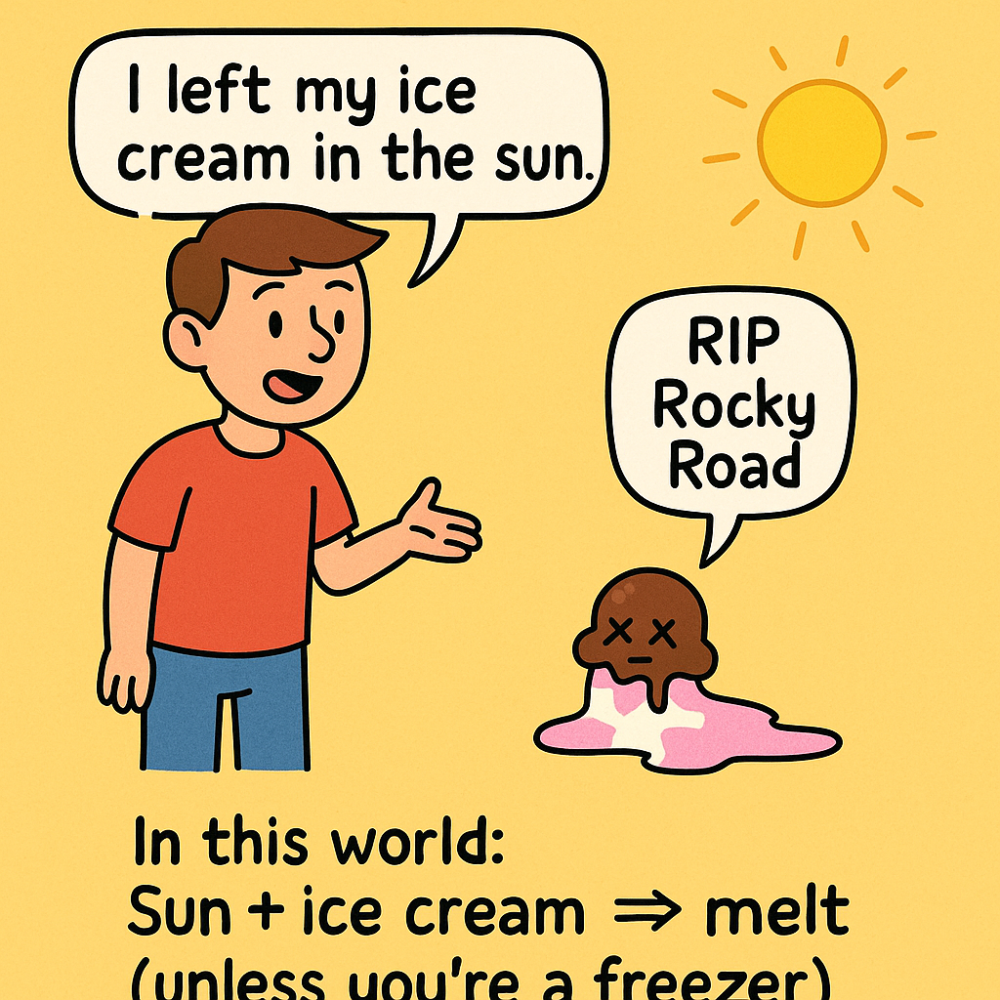
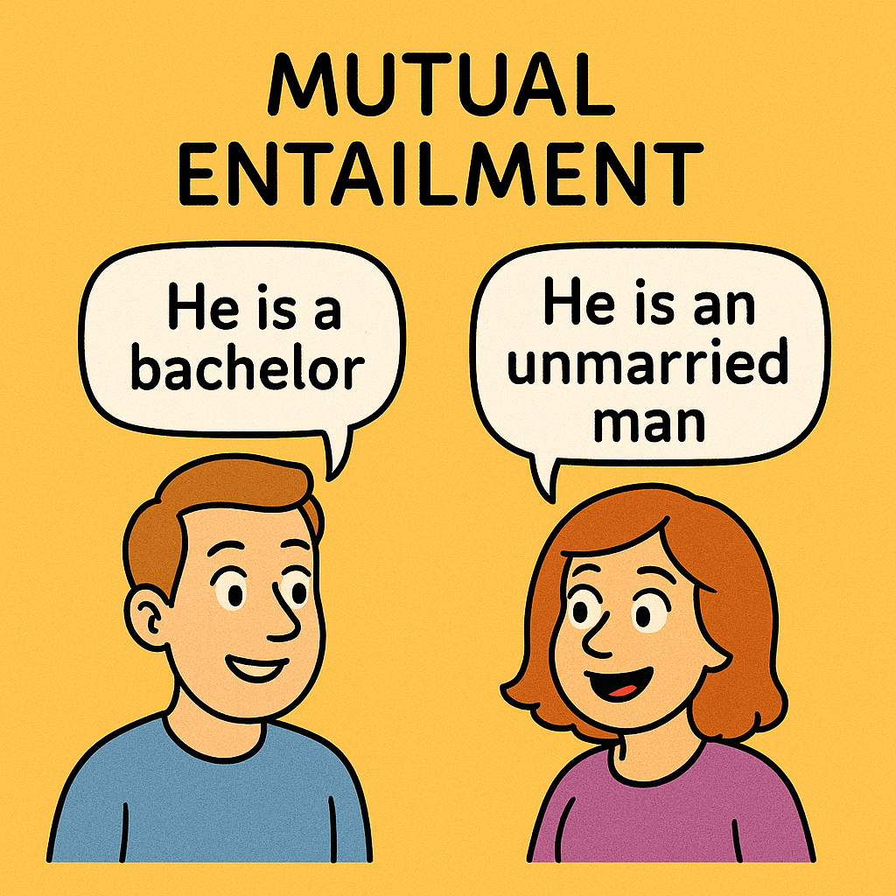
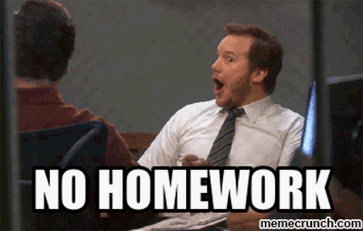

## **Previously on 201**
 
### Midterm   
### Semantics
  - **Lexical Semantics**: the meaning of words (or lexical items)
  - **Compositional Semantics**: the meaning beyond words (phrases, sentences, e.g.)  

### **truth value**: if a proposition is **TRUE** or **FALSE**   
### **possible worlds**: an alternative reality where we want to check on the proposition's **truth value**

---
## Different Meanings in Languages   
.pull-left[
**literal meaning**  
  - **Semantics** studies <u>*literal meaning*</u> in language   
  
<b>implied meaning</b>  
  - <b>Pragmatics</b> studies <u>*implied meaning*</u> in language   
  
<b>social meaning</b>  
  - <b>Sociolinguistics</b> and <b>Linguistic Anthropology</b> study <u>*social meaning*</u>
]
.pull-right[

]

---
## **Semantic Relations**
 
.pull-left[
- **synonym:** words that have the same reference / refer to the same set of things in the world
  - <b>drinks</b> and <b>beverages</b>  
- **hypernym:** words whose reference is a **superset** of another words reference  
  - <b>student</b> is a hypernym to <b>linguistics student</b>  
- **hyponym:** words whose reference is a **subset** of another words reference
  - <b>dog</b> is a hyponym to <b>mammal</b>  
- **antonym:** words that have opposite meanings
]
.pull-right[

]

---
## **Semantic Relations: Antonyms**
 
.pull-left[
- **complementary pairs:** items that can't be in both categories
  - <b>alive</b> vs. <b>dead</b>  
  
- **gradable pairs:** opposite ends of a scale
  - <b>young</b> vs. <b>old</b>  
  
- **reverses:** opposite directions
  - <b>up</b> vs. <b>down</b>  
  
- **converses:** same action, different perspective
  - <b>buy</b> vs. <b>sell</b>  
]
.pull-right[

]

---
## Practics: Semantic Relations
 
- Are the following word pairs **synonyms**, **antonyms**, or a **hypernym-hyponym pair**? If the last, which is the
hypernym and which is the hyponym?  
.pull-left[
 

]
.pull-right[
1. bird – avian  
2. bird – sparrow  
3. bird – animal  
4. synonym - antonym (what type?)  
5. hypernym - hyponym (what type?)  
6. Rutgers - universities  
7. Linguistics - Mathematics  
8. **MORE**?
]

---
class: middle, center

## **ENTAILMENT**   

### sentence **p** entails sentence **q** <b>iff</b> **q** is true <b>whenever</b> **p** is true.  

### <b>iff</b>: if and only if
### "<b>whenever</b>": it means you cannot find any possible world, 
### where **q** is **false** while **p** is **true**

---
class: middle, center

## **ENTAILMENT**   

### sentence **p** entails sentence **q** <b>iff</b> **q** is true <b>whenever</b> **p** is true.  

### <u>Merlin is a Linguistics student</u>. ***entails*** <u>Merlin is a student</u>.   
### If Merlin is **NOT** a student, it means
### there is **NO** possibility for Merlin to be a Linguistics student.
  
---
.pull-left[
## Practice I: Entailment
]
.pull.right[
**Entailment**: Sentence **p** entails sentence **q** <b>iff</b> 
**q** is true whenever **p** is true.
]
 
For each pair of sentences, which one entails the other one?  
.pull-left[
- **a**. Charles III is the King of the United Kingdom. 
**b**. Queen Elizabeth II was Charles's mother.  
- **a**. I am tired. 
**b**. I am very very very very very very tired.  
- **a**. Bob live above a restaurant on Ocean Avenue. 
**b**. Bob and Linda lives above a restaurant on Ocean Avenue.  
- **a**. The kids trick-or-treated on Halloween. 
**b**. The kids trick-or-treated in scary costumes on Halloween.
]
.pull-right[

]

---
.pull-left[
## Practice II: Entailment
]
.pull.right[
**Entailment**: Sentence **p** entails sentence **q** <b>iff</b> 
**q** is true whenever **p** is true.
]
 

Work in <b>GROUP</b>, think of three sentences that are entailed by each of these sentences:  

.pull-left[
- **a**.  
The spotted lanternfly is an insect that has spread invasively to New Jersey and can cause damage to forests and fruit crops.  
- **b**.  
The starship Enterprise explored strange new worlds, sought out new life and new civilizations, and boldly went where no one had gone before.  
]
.pull-right[

]

---
.pull-left[
## Practice II: Entailment
]
.pull.right[
**Entailment**: Sentence **p** entails sentence **q** <b>iff</b> 
**q** is true whenever **p** is true.
]
 

Work in <b>GROUP</b>, think of three sentences that are entailed by each of these sentences:  
.pull-left[
- **c**.  
Controversially, DeLa chose to eliminate herself from the competition after winning the lip-sync battle, which allowed Trixie, Kennedy, and Shangela to all stay in the competition.  
- **d**.  
Mario defeated Bowser, but then all he found in the dungeon was Toad, who told him that the princess was in another castle.
]
.pull-right[
  

]

---
## **Logical Entailment**  
.pull-left[
- **p** *entails* **q** for logical reasons, **regardless** of world knowledge or lexical meaning   
**p**: <b>The cat sat on the mat.</b>  
**q**: <b>There is a cat/mat.</b>   
**p**: <b>(a dog): I heard the can opener.</b>  
**q**: <b>(Therefore for the dog), FOOD EXISTS!.</b>   
- We got the entailment relation between **p** and **q** by logical inferences
]
.pull-right[

]

---
## **World-specific Entailment**  
.pull-left[
- **p** *entails* **q** due to world knowledge or lexical meaning  
**p**: <b>Charles III is the King of the United Kingdom.</b>  
**q**: <b>Queen Elizabeth II was Charles's mother.</b>   
**p**: <b>Merlin is from Scotland. </b>  
**q**: <b>Merlin is from UK.</b>   
- We got the entailment relation between **p** and **q** by making reference to how the world works, or to knowledge of lexical meaning
]
.pull-right[

]

---
## **Mutual Entailment**  
.pull-left[
- **p** *entails* **q** <b>AND</b> **q** *entails* **p** as well.  
**p**: <b>Merlin is a sorcerer.</b>  
**q**: <b>Merlin is a wizard.</b>   
**p**: <b>Merlin is immortal </b>  
**q**: <b>Merlin is not capable of dying.</b>   
]
.pull-right[

]

---
class: center, middle
**no homework** is due this week, none until OCT 26!  
continue reading for **SEMANTICS** [*Fromkin Ch7*]   

  
Slides created via the R package [**xaringan**](https://github.com/yihui/xaringan).
