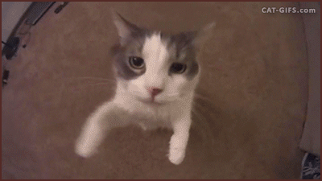
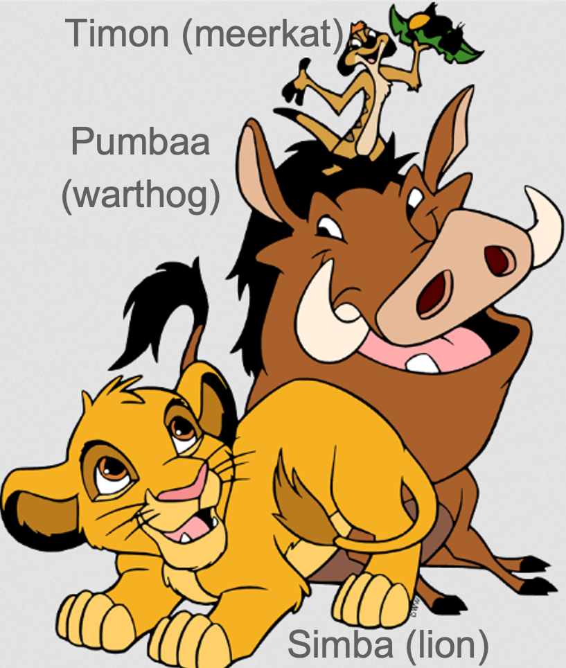

## **Previously on 201**
 
.pull-left[
- **different meanings in languages**  
  1. literal meaning (semantics)  
  2. implied meaning (pragmatics)  
  3. social meaning (sociolinguistics)  
- **semantic relations**   
  1. synonym *<u>drinks</u>* vs. *<u>beverages</u>*  
  2. hypernym *<u>universities</u>* to *<u>Rutgers</u>*  
  3. hyponym *<u>jeans</u>* to *<u>pants</u>*   
  4. antonym

]
.pull-right[
- **entailment**: sentence **p** entails sentence **q** <b>iff</b> **q** is true <b>whenever</b> **p** is true.  
  - world-specific entailment (**q** entails **p**)
  
  <b>*p*</b>: The water is <b>hot</b> <u>now</u>.
  
  <b>*q*</b>: The water is <b>boiled</b> <u>now</u>  
  - logical entailment  (**p** entails **q**)
  
  <b>*p*</b>: He finished <b>all</b> his homework.
  
  <b>*q*</b>: He finished <b>some of</b> his homework.  
  - mutual entailment
  
  <b>*p*</b>: Mary is <b>older</b> than John.
  
  <b>*q*</b>: John is <b>younger</b> than Mary.  
]

---
## **SET**
 
.pull-left[
A word's **reference** is the <b>SET</b> of entities (referents) that the word refers to.
  
A <b>SET</b> is <u>a collection/list of items  
In **mathematics**:

- a <b>SET</b> needs to be **well-defined**
- meaning there is at least one **commonality** among all items.  

- {2, 4, 6, 8, 10,...} [the set of even numbers]  

Yet in **semantics**:

- a **list** is also considered a <b>SET</b>  
- {legitmate, 3x=5, OIIAI-cat.GIF, *never-gonna-give-you-up.MP4*}
]
.pull-right[
  

  

]

---
class: center, middle, video-slide

<video id="vid"
  src="https://merlinudinov.github.io/ling201recitation/pic/1024/never_web.mp4"
  type="video/mp4"
  autoplay
  muted
  controls     <!-- ✅ adds play/pause + volume/unmute -->
  playsinline>
</video>

---
## **Set Theory**
 
.pull-left[
1. in a set, **order** of items <b>does not</b> matter
  - {a, b, c} = {a, c, b} = {b, a, c} = {b, c, a} = {c, a, b} = {c, b, a} 
  
2. **repetitions** of items <b>do not</b> count as 'separate' items.
  - {a, b, c} = {a, a, a, b, c} = {a, b, b, c, c}
  
3. An <b>ITEM</b> in a set is called the **MEMEBER** of that set
  - and we use symbol **∈** to describe membership relation   
  - a **∈** {a, b, c}
  - a **is in** / <b>belongs to</b> / <b>is an element of</b> the set {a, b, c}
]
.pull-right[

]

## **∈ ∉**
---
## **Set Theory**
 
.pull-left[
### **List Notation**
 
The **list notation** specifies a set by listing its members  between {curly brackets}  
  - The set *T* is characters in ***Tom and Jerry***
  - *T* = {Tom, Jerry, Tuffy, Spike, Tyke, Butch, Quacker, Cuckoo...}
  

]

.pull-right[
### **Predicate Notation**
 
The **predicate notation** specifies a set by listing its members  
- *S* = { x **|** x is a sorcerer }
- "*S* equals the set of elements <b>*x*</b>, such that **every** <b>*x*</b> is a sorcerer"
- normal words: "the set of all sorcerers"
- **|** stands for "*<u>such that</u>*" 
  

  

]

---
## **Set Theory**: relations between two sets
.pull-left[
### **subset (⊆)**:
- A is a subset of B if **every** element of A is **also** an element of B
  - {a, b} **⊆** {a, b, c}
  - {a, b} **⊆** {a, b}
  - **~~a ⊆ {a, b, c}~~**, this is **WRONG**, because **a** is not a set

### **proper subset (⊂)**:
- A is a proper subset of B if A is a **subset** of B and they are not **identical**
  - {a, b} **⊆** {a, b, c}

### **identity (=)**:
- two sets are identical/equal if they have **exactly the same** elements
  - {a, b} **=** {b, a}
]
.pull-right[
  
]

---
## **Set Operations: (∪aa∩aa-aa')**
 

--

### <b>union (∪)</b>
- produces a new set which contains <b>all elements</b> that belong to <b>both sets</b> (including elements in both sets)  

--

### <b>intersection (∩)</b>
- produces a new set that <b>only contains</b> elements that belong to <b>BOTH</b> sets  

--

### <b>difference (-)</b>
- the difference of A and B is a new set which contains all elements that <b>belong to A</b>, but <b>NOT B</b>
- A - B is <b>not</b> equal to B - A in most cases  

--

### **complement (')**
- produces a new set which contains all elements in the **relevant universe** that are **NOT** in the set

---
## **Set Theory**: relations between two sets
 
.pull-left[
### **cardinality**: the number of elements in a set
 
- if A = {a, b, c}

  then the **cardinality** of the set A, **|A|** = 3
  
  also, **|A|** = **|{a, b, c}|**  
- <b>singleton set</b>: a set with cardinality = 1
- <b>null set</b> <b>empty set</b>: a set with cardinality = 0
  - {} = **Ø** "empty set"
]
.pull-right[
   
  
]
  
when talking about the **meaning** of a word, and not its structure, use:

### **[[double brackets]]**

---
class: middle, center

# **BACK** <b>TO</b> LANGUAGES<b></b>

---
## **Lexicon**: how parts of speech are defined
 
.pull-left[

### <b>proper nouns</b>
- [[Merlin]] <b>aaaa</b>(*Merlin is an element*)   

### <b>common nouns</b>
- [[sorcerer]] = { x | x is a sorcerer }   

### <b>adjectives nouns</b>
- [[desperate]] = { x | x is desperate }   

### **verbs**
- [[run]] = { x | x runs }
]
.pull-right[
  
]

---
## Practice I
 
**define the reference in terms of sets** 
.pull-left[
### 1. <b>[[sleep]]</b>
[[sleep]] = { x | x sleeps }</b>  

### 2. <b>[[Arthur]]</b>
[[Arthur]] = arthur</b>  

### 3. <b>[[happy]]</b>
[[happy]] = { x | x is happy }</b>  

### 4. **[[king]]**
[[king]] = { x | x is a king }</b>
]
.pull-right[
  
]

---
## Practice I
 
**define the reference in terms of sets** 
.pull-left[
### 1. <b>[[sleep]]</b>
[[sleep]] = { x | x sleeps }  

### 2. <b>[[Arthur]]</b>
[[Arthur]] = arthur   

### 3. <b>[[happy]]</b>
[[happy]] = { x | x is happy }  

### 4. **[[king]]**
[[king]] = { x | x is a king }
]
.pull-right[
  
]

---
## **Composition of meanings**
### sentence type I (proper name subjects)
 
.pull-left[
**"name is NOUN"**
- [[name]] ∈ [[NOUN]]
- "Arthur is a king."
  - [[Arthur]] ∈ [[king]]
  

<b>"name VERB"</b>
- [[name]] ∈ [[VERB]]
- "Arthur sleeps."
  - [[Arthur]] ∈ [[sleep]]
  

<b>"name is ADJECTIVE"</b>
- [[name]] ∈ [[ADJ]]
- "Arthur is happy"
  - [[Arthur]] ∈ [[happy]]
]
.pull-right[
  
  
]

---
## **Composition of meanings**
### sentence type II (common noun subjects)
 
.pull-left[
  
]
.pull-right[
**"name is NOUN"**
- [[NOUN]] ∈ [[NOUN]]
- "sorcerers are winners."
  - [[sorcerer]] ∈ [[winner]]
  

<b>"name VERB"</b>
- [[NOUN]] ∈ [[VERB]]
- "sorcerers giggle."
  - [[sorcerer]] ⊆ [[giggle]]
  

<b>"name is ADJECTIVE"</b>
- [[NOUN]] ∈ [[ADJ]]
- "sorcerers are evil"
  - [[sorcerer]] ⊆ [[evil]]
]

---
## **Composition of meanings**
### sentence type III (complex sentences)
 
.pull-left[
<b>"name is ADJECTIVE NOUN"</b>
- [[name]] **∈** [[ADJ]] **∩** [[NOUN]]
- "Arthur is a famous king."
  - [[Arthur]] **∈** [[famous]] **∩** [[king]]
  

<b>"ADJECTIVE NOUNs are ADJECTIVE"</b>
- [[ADJ]] **∩** [[NOUN]] **⊆** [[NOUN]]
- "Evil sorcerers are terrible"
  - [[evil]] **∩** [[sorcerer]] **⊆** [[terrible]]
]
.pull-right[
  
]

---
## Practice II
 
**Translate sentences into set theory expressions.**  
.pull-left[
1. Music is beautiful.  
2. Beautiful fish swim.  
3. Arthur is an ancient figure.   
4. Arthur and Merlin are good friends.   
5. Dark magic is a horrible thing.  
6. Big old dogs are friendly.
]
.pull-right[
  
]

---
class: middle, center

# **MORE** <b>PRACTICE</b>
   
## <b>MARIO UNIVERSE</b>
   
---
## **Practice with Sets: Mario Universe**
### list notation and predicate notation  
**Define the following sets using both list notation and predicate notation:**  
.pull-left[
1. M, the set of characters with mustaches  
2. P, the set of characters who are/wear pink  
3. C, the set of characters with crowns  
4. G, the set of characters who are ghosts   

Are any of the sets defined above **singletons**? Which one(s)?
]
.pull-right[
<u>***U*** = universe of Mario Kart characters</u>  

]

---
## **Practice with Sets: Mario Universe**
### <b>A</b>  
**True or false? Why?**  
.pull-left[
1. Mario ∈ M  
2. Peach ∉ C  
3. | C | = 3  
4. {Daisy, Birdo, Luigi} = {Luigi, Daisy, Birdo}  
5. | { x | x has a name that starts with 'W' } | = {Wario, Waluigi}
]
.pull-right[
<u>***U*** = universe of Mario Kart characters</u>  

]

---
## **Practice with Relations: Mario Universe**
 
**Using the sets defined on the lower right, determine if each of these expressions is true or false.**  
.pull-left[
1. M ⊂ H  
2. R ⊆ F  
3. H = N  
4. N ⊆ M  
5. R ⊄ N  
6. F ⊈ M  

.pull-left[
<small><small><small>
A **=** B: equality/identity

A **⊆** B: subset

A **⊂** B: proper subset
</small></small></small>
]
.pull-right[
<small><small><small>
A **≠** B: not equal/identical

A **⊈** B: not a subset

A **⊄** B: not a proper subset
</small></small></small>
]
]
.pull-right[
<u> ***U*** = universe of Mario Kart characters</u>
  

 
<small><small><small><i>
**M** = { x | x has a mustache} = {Mario, Luigi, Wario, Waluigi}

**H** = { x | x has a hat} = {Mario, Luigi, Baby Mario, Baby Luigi, Wario, Waluigi}

**N** = { x | x is a human} = {Mario, Luigi, Baby Mario, Baby Luigi, Peach, Daisy, Wario, Waluigi}

**R** = { x | x is a princess} = {Peach, Daisy}

**F** = { x | x is a female human} = {Peach, Daisy}
</i></small></small></small>
]

---
## **Practice with Sets: Mario Universe**
 
.pull-left[
**Given these sets, calculate the following and describe the resulting set in words:**  
1. C ∪ P
2. H ∩ O
3. H – M
4. P ′
5. C ∩ S
6. | F ∪ S |
7. | C ∩ P |
8. O – H
9. ( C ∩ F ) ∪ M
10. ( F ∪ H )′
11. True or False: F ∩ S = S ∩ F
12. True or False: F – S = S – F   

.pull-left[
<small><small><small>
<i>A **∪** B</i>: union

<i>A **∩** B</i>: intersection
</small></small></small>
]
.pull-right[
<small><small><small>
<i>A **-** B</i>: difference

<i>A**'**</i>: complement
</small></small></small>
]
]

.pull-right[
<u> ***U*** = universe of Mario Kart characters</u>
  

 
<small><small><small><i>
**M** = { x | x has a mustache} = {Mario, Luigi, Wario, Waluigi}

**H** = { x | x has a hat} = {Mario, Luigi, Baby Mario, Baby Luigi, Wario, Waluigi}

**C** = { x | x has a crown} = {Peach, Daisy, King Boo}

**F** = { x | x has fangs} = {Bowser, Petey Piranha, King Boo}

**P** = { x | x is/wears pink} = {Peach, Birdo, Toadette}

**S** = { x | x has spots} = {Toad, Toadette, Petey Piranha}

**O** = { x | x's name ends in "o" } = { Mario, Baby Mario, Wario, Birdo, King Boo }
</i></small></small></small>
]

---
class: middle, center

# **MORE** <b>MORE</b> <b>PRACTICE</b>
   
## <b>LION KING UNIVERSE</b>

---
## **Practice: Lion King Universe**
 
**Write out the lexical meaning of these words using predicate notation.**  
.pull-left[
1. lion				
  [[lion]] = L = { x | x is lion }   
2. warthog  
3. brown  
4. meerkat  
5. smile  
6. ferocious
]
.pull-right[

]

---
## **Practice: Lion King Universe**
 
**Write out the compositional meaning of these sentences using set theory. Are they true or false?**   
.pull-left[
1. Timon is a warthog.

  [[Timon]] ∈ [[warthog]]   			
2. Simba is brown.  
3. Meerkats are ferocious.  
4. Pumbaa smiles.  
5. Lions are not meerkats.  
]
.pull-right[

]

---
## **Practice: Lion King Universe**
 
**Use set notation to specify the meaning of each of the following sentences:**  
.pull-left[
1. Simba is a cute lion.  
2. Lions are ferocious creatures.  
3. Pumbaa is smelly.  
4. Adult lions roar.  
5. Young lions are adorable animals.  
6. Pumbaa is not a sarcastic meerkat.  
7. Timon and Pumbaa are friendly.  
8. Lions and warthogs are ferocious.  
6-8 are **tricky**!
]
.pull-right[

]

---
## **Practice: Stardew Valley universe**
 
**Given the definitions to the right, express the meaning of the following sentences using set theory:**  
.pull-left[
1. Abigail is a villager.  
2. Mr. Qi does not live in Pelican Town.  
3. Every farmer grows crops.  
4. Some villagers raise chickens.  
5. Only one farmer lives in Pelican Town.  
6. Most villagers live in Pelican Town.  
7. Marnie and Shane both raise chickens.  
8. Neither Robin nor Abigail grow crops.
]
.pull-right[
[[Marnie]] = *m* 
[[Shane]] = *s* 
[[Mr. Qi]] = *q* 
[[Robin]] = *r* 
[[Abigail]] = *a*  
[[villager]] = { x | x is a villager } = *V* 
[[farmer]] = { x | x is a farmer } = *F* 
[[grow crops]] = { x | x grows crops } = *G* 
[[raise chickens]] = { x | x raises chickens } = *C* 
[[live in Pelican Town]] = { x | x lives in Pelican Town } = *P*
]

---
class: center, middle
**Homework IV** is due this Sunday (**Oct 26**)  
**Homework V** will be published this week which is due next Sunday (**Nov 2**)  
**reading materials** before Wednesday class 
Chapter 8: Pragmatics, Griffiths & Cummins' (2017) *An Introduction to English Semantics and Pragmatics*  

  
Slides created via the R package [**xaringan**](https://github.com/yihui/xaringan).
